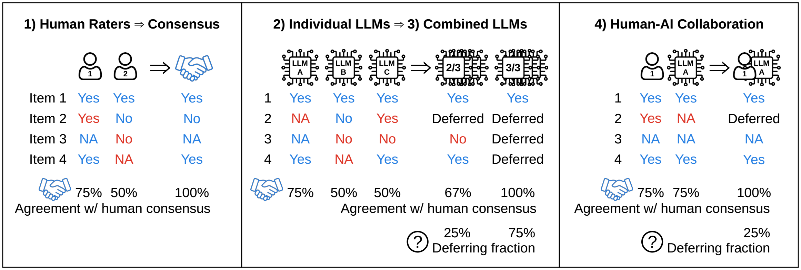
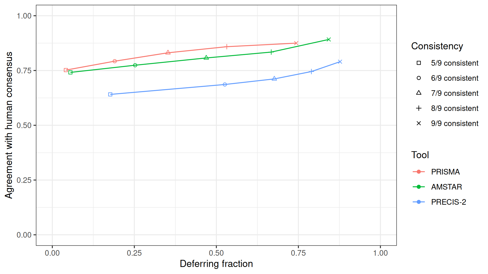

```{css}
table.dataTable tbody td {
  font-size: 10pt;
  padding: 5px
}
```

<script>
// Functions to make tool header rows in tables clickable to (un)filter specific research assessment tool
function headerFunctionAccuracy() {
  for (x of $("#DataTables_Table_0 th[scope=\'row\']")) { x.innerHTML = "<a onclick=\"$(\'#DataTables_Table_0\').DataTable().columns(0).search(\'" + ($('#DataTables_Table_0').DataTable().columns(0).search()[0] ? '' : x.innerHTML) + "\').draw()\" style=\"cursor: pointer\">" + x.innerHTML + "</a>" }
}
function headerFunctionCollabAccuracy() {
  for (x of $("#DataTables_Table_1 th[scope=\'row\']")) { x.innerHTML = "<a onclick=\"$(\'#DataTables_Table_1\').DataTable().columns(0).search(\'" + ($('#DataTables_Table_1').DataTable().columns(0).search()[0] ? '' : x.innerHTML) + "\').draw()\" style=\"cursor: pointer\">" + x.innerHTML + "</a>" }
}
function headerFunctionPrecision() {
  for (x of $("#DataTables_Table_2 th[scope=\'row\']")) { x.innerHTML = "<a onclick=\"$(\'#DataTables_Table_2\').DataTable().columns(0).search(\'" + ($('#DataTables_Table_2').DataTable().columns(0).search()[0] ? '' : x.innerHTML) + "\').draw()\" style=\"cursor: pointer\">" + x.innerHTML + "</a>" }
}
function headerFunctionFormattingQuoting() {
  for (x of $("#DataTables_Table_3 th[scope=\'row\']")) { x.innerHTML = "<a onclick=\"$(\'#DataTables_Table_3\').DataTable().columns(0).search(\'" + ($('#DataTables_Table_3').DataTable().columns(0).search()[0] ? '' : x.innerHTML) + "\').draw()\" style=\"cursor: pointer\">" + x.innerHTML + "</a>" }
}
</script>


```{r, results='hide'}
suppressPackageStartupMessages(library(ggplot2))
suppressPackageStartupMessages(library(ggrepel))
suppressPackageStartupMessages(library(patchwork))
suppressPackageStartupMessages(library(DT))
suppressPackageStartupMessages(library(tidyr))
suppressPackageStartupMessages(library(dplyr))

REDO_PLOTS = F

# Load all experiments data

folders_prisma = c(
  human_rater1_prisma="prisma_amstar/human_rater1_prisma_amstar",
  human_rater2_prisma="prisma_amstar/human_rater2_prisma_amstar",
  claude3_opus_prisma="prisma_amstar/claude3_opus_prisma_amstar",
  claude3_opus_prisma_rep="prisma_amstar/claude3_opus_prisma_amstar_rep",
  claude2_prisma="prisma_amstar/claude2_prisma_amstar",
  claude2_prisma_rep="prisma_amstar/claude2_prisma_amstar_rep",
  claude2_chat_prisma="prisma_amstar/claude2_chat_prisma_amstar",
  claude2_chat_prisma_rep="prisma_amstar/claude2_chat_prisma_amstar_rep",
  claude2_chat_gpt3.5_prompt_prisma="prisma_amstar/claude2_chat_gpt3.5_prompt_prisma",
  gpt4_prisma="prisma_amstar/gpt4_prisma_amstar",
  gpt3.5_prisma="prisma_amstar/gpt3.5_prisma",
  gpt3.5_prisma_rep="prisma_amstar/gpt3.5_prisma_rep",
  mixtral8x22b_prisma="prisma_amstar/mixtral8x22b_prisma_amstar",
  mixtral8x22b_prisma_rep="prisma_amstar/mixtral8x22b_prisma_amstar_rep",
  mixtral8x7b_prisma="prisma_amstar/mixtral8x7b_prisma_amstar",
  mixtral8x7b_prisma_rep="prisma_amstar/mixtral8x7b_prisma_amstar_rep",
  llm_consistency_9_prisma="prisma_amstar/llm_consistency_9_prisma_amstar",
  llm_consistency_8_prisma="prisma_amstar/llm_consistency_8_prisma_amstar",
  llm_consistency_7_prisma="prisma_amstar/llm_consistency_7_prisma_amstar",
  llm_consistency_6_prisma="prisma_amstar/llm_consistency_6_prisma_amstar",
  llm_consistency_5_prisma="prisma_amstar/llm_consistency_5_prisma_amstar"
)
folders_amstar = c(
  human_rater1_amstar="prisma_amstar/human_rater1_prisma_amstar",
  human_rater2_amstar="prisma_amstar/human_rater2_prisma_amstar",
  claude3_opus_amstar="prisma_amstar/claude3_opus_prisma_amstar",
  claude3_opus_amstar_rep="prisma_amstar/claude3_opus_prisma_amstar_rep",
  claude2_amstar="prisma_amstar/claude2_prisma_amstar",
  claude2_amstar_rep="prisma_amstar/claude2_prisma_amstar_rep",
  claude2_chat_amstar="prisma_amstar/claude2_chat_prisma_amstar",
  claude2_chat_amstar_rep="prisma_amstar/claude2_chat_prisma_amstar_rep",
  claude2_chat_gpt3.5_prompt_amstar="prisma_amstar/claude2_chat_gpt3.5_prompt_amstar",
  gpt4_amstar="prisma_amstar/gpt4_prisma_amstar",
  gpt3.5_amstar="prisma_amstar/gpt3.5_amstar",
  gpt3.5_amstar_rep="prisma_amstar/gpt3.5_amstar_rep",
  mixtral8x22b_amstar="prisma_amstar/mixtral8x22b_prisma_amstar",
  mixtral8x22b_amstar_rep="prisma_amstar/mixtral8x22b_prisma_amstar_rep",
  mixtral8x7b_amstar="prisma_amstar/mixtral8x7b_prisma_amstar",
  mixtral8x7b_amstar_rep="prisma_amstar/mixtral8x7b_prisma_amstar_rep",
  llm_consistency_9_amstar="prisma_amstar/llm_consistency_9_prisma_amstar",
  llm_consistency_8_amstar="prisma_amstar/llm_consistency_8_prisma_amstar",
  llm_consistency_7_amstar="prisma_amstar/llm_consistency_7_prisma_amstar",
  llm_consistency_6_amstar="prisma_amstar/llm_consistency_6_prisma_amstar",
  llm_consistency_5_amstar="prisma_amstar/llm_consistency_5_prisma_amstar"
)
folders_precis2 = c(
  human_rater1_precis2="precis2/human_rater1_precis2",
  human_rater2_precis2="precis2/human_rater2_precis2",
  claude3_opus_precis2="precis2/claude3_opus_precis2",
  claude3_opus_precis2_rep="precis2/claude3_opus_precis2_rep",
  claude3_opus_gpt4_prompt_precis2="precis2/claude3_opus_gpt4_prompt_precis2",
  claude2_precis2="precis2/claude2_precis2",
  claude2_precis2_rep="precis2/claude2_precis2_rep",
  claude2_chat_precis2="precis2/claude2_chat_precis2",
  claude2_chat_precis2_rep="precis2/claude2_chat_precis2_rep",
  claude2_chat_gpt3.5_prompt_precis2="precis2/claude2_chat_gpt3.5_prompt_precis2",
  gpt4_precis2="precis2/gpt4_precis2",
  gpt3.5_precis2="precis2/gpt3.5_precis2",
  gpt3.5_precis2_rep="precis2/gpt3.5_precis2_rep",
  mixtral8x22b_precis2="precis2/mixtral8x22b_precis2",
  mixtral8x22b_precis2_rep="precis2/mixtral8x22b_precis2_rep",
  mixtral8x7b_precis2="precis2/mixtral8x7b_precis2",
  mixtral8x7b_precis2_rep="precis2/mixtral8x7b_precis2_rep",
  mixtral8x7b_gpt4_prompt_precis2="precis2/mixtral8x7b_gpt4_prompt_precis2",
  llm_consistency_9_precis2="precis2/llm_consistency_9_precis2",
  llm_consistency_8_precis2="precis2/llm_consistency_8_precis2",
  llm_consistency_7_precis2="precis2/llm_consistency_7_precis2",
  llm_consistency_6_precis2="precis2/llm_consistency_6_precis2",
  llm_consistency_5_precis2="precis2/llm_consistency_5_precis2"
)
folders = c(folders_prisma, folders_amstar, folders_precis2)

# For now all three tools must have the same number of items, if want to change, adapt accordingly like above where length(folders_precis2) > length(prisma)
folders_reliability = c(
  # PRISMA
  prisma_human="prisma_amstar/human_rater1_prisma_amstar", prisma_claude3_opus="prisma_amstar/claude3_opus_prisma_amstar", prisma_claude2="prisma_amstar/claude2_prisma_amstar", prisma_claude2_chat="prisma_amstar/claude2_chat_prisma_amstar", prisma_gpt4="prisma_amstar/gpt4_prisma_amstar", prisma_gpt3.5="prisma_amstar/gpt3.5_prisma", prisma_mixtral8x22b="prisma_amstar/mixtral8x22b_prisma_amstar", prisma_mixtral8x7b="prisma_amstar/mixtral8x7b_prisma_amstar",
  # AMSTAR
  amstar_human="prisma_amstar/human_rater1_prisma_amstar", amstar_claude3_opus="prisma_amstar/claude3_opus_prisma_amstar", amstar_claude2="prisma_amstar/claude2_prisma_amstar", amstar_claude2_chat="prisma_amstar/claude2_chat_prisma_amstar", amstar_gpt4="prisma_amstar/gpt4_prisma_amstar", amstar_gpt3.5="prisma_amstar/gpt3.5_amstar", amstar_mixtral8x22b="prisma_amstar/mixtral8x22b_prisma_amstar", amstar_mixtral8x7b="prisma_amstar/mixtral8x7b_prisma_amstar", 
  # PRECIS_2
  precis2_human="precis2/human_rater1_precis2", precis2_claude3_opus="precis2/claude3_opus_precis2", precis2_claude2="precis2/claude2_precis2", precis2_claude2_chat="precis2/claude2_chat_precis2", precis2_gpt4="precis2/gpt4_precis2", precis2_gpt3.5="precis2/gpt3.5_precis2", precis2_mixtral8x22b="precis2/mixtral8x22b_precis2", precis2_mixtral8x7b="precis2/mixtral8x7b_precis2"
)

get_filename_suffix = Vectorize(function(experiment) {
  if (grepl("prisma", experiment)) {
    items = 27
  } else if (grepl("amstar", experiment)) {
    items = 11
  } else if (grepl("precis2", experiment)) {
    items = 9
  }
  #if (grepl("consistency", experiment)) items = paste("_self_consistency_", items)
  paste0(items, "_items")
})

# Single experiments vs human consensus

named_i = 1:length(folders)
names(named_i) = names(folders)

consensus_vs = do.call(
  "rbind",
  lapply(named_i, function(i) read.csv(paste0(folders[i], "/results/human_consensus_", get_filename_suffix(names(folders)[i]), ".csv"), row.names = 1)),
)
colnames(consensus_vs) = c("Kappa", "Kappa_CI_low", "Kappa_CI_high", "Agreement", "Agreement_CI_low", "Agreement_CI_high", "Deferring Fraction", "Deferring Fraction_CI_low", "Deferring Fraction_CI_high")

# Compare LLM responses
summ=consensus_vs[paste0(names(folders), ".combined"),]
summ=summ[!grepl("_rep", rownames(summ)),]
summ=summ[!grepl("human_rater", rownames(summ)),]
summ=summ[!grepl("self_co", rownames(summ)),]
summ=summ[!grepl("llm_", rownames(summ)),]
summ=summ[!grepl("prompt", rownames(summ)),]
summ$llm = gsub("_p.*", "", gsub("_a.*", "", rownames(summ)))
summ = as.data.frame(summ %>% group_by(llm) %>% summarize_all(mean))[c("llm", "Kappa", "Agreement")]
summ = summ[order(summ$Agreement),]

main_experiments_prisma = c("(1) Human Rater 1"=T, "(1) Human Rater 2"=F, "(2) Claude-3-Opus"=T, "(2) Claude-3-Opus repeated"=F, "(2) Claude-2"=T, "(2) Claude-2 repeated"=F, "(2) Claude-2 Chat"=F, "(2) Claude-2 Chat repeated"=F, "(2) Claude-2 Chat GPT-3.5 prompt"=F, "(2) GPT-4"=T, "(2) GPT-3.5"=T, "(2) GPT-3.5 repeated"=F, "(2) Mixtral-8x22B"=T, "(2) Mixtral-8x22B repeated"=F, "(2) Mixtral-8x7B"=F, "(2) Mixtral-8x7B repeated"=F, "(3) Combined LLMs (consistent in 9/9)"=T, "(3) Combined LLMs (consistent in 8/9)"=T, "(3) Combined LLMs (consistent in 7/9)"=T, "(3) Combined LLMs (consistent in 6/9)"=T, "(3) Combined LLMs (consistent in 5/9)"=T)
main_experiments_amstar = c("(1) Human Rater 1"=T, "(1) Human Rater 2"=F, "(2) Claude-3-Opus"=T, "(2) Claude-3-Opus repeated"=F, "(2) Claude-2"=T, "(2) Claude-2 repeated"=F, "(2) Claude-2 Chat"=F, "(2) Claude-2 Chat repeated"=F, "(2) Claude-2 Chat GPT-3.5 prompt"=F, "(2) GPT-4"=T, "(2) GPT-3.5"=T, "(2) GPT-3.5 repeated"=F, "(2) Mixtral-8x22B"=T, "(2) Mixtral-8x22B repeated"=F, "(2) Mixtral-8x7B"=F, "(2) Mixtral-8x7B repeated"=F, "(3) Combined LLMs (consistent in 9/9)"=T, "(3) Combined LLMs (consistent in 8/9)"=T, "(3) Combined LLMs (consistent in 7/9)"=T, "(3) Combined LLMs (consistent in 6/9)"=T, "(3) Combined LLMs (consistent in 5/9)"=T)
main_experiments_precis2 = c("(1) Human Rater 1"=T, "(1) Human Rater 2"=F, "(2) Claude-3-Opus"=T, "(2) Claude-3-Opus repeated"=F, "(2) Claude-3-Opus GPT-4 prompt"=F, "(2) Claude-2"=T, "(2) Claude-2 repeated"=F, "(2) Claude-2 Chat"=F, "(2) Claude-2 Chat repeated"=F, "(2) Claude-2 Chat GPT-3.5 prompt"=F, "(2) GPT-4"=T, "(2) GPT-3.5"=T, "(2) GPT-3.5 repeated"=F, "(2) Mixtral-8x22B"=T, "(2) Mixtral-8x22B repeated"=F, "(2) Mixtral-8x7B"=F, "(2) Mixtral-8x7B repeated"=F, "(2) Mixtral-8x7B GPT-4 prompt"=F, "(3) Combined LLMs (consistent in 9/9)"=T, "(3) Combined LLMs (consistent in 8/9)"=T, "(3) Combined LLMs (consistent in 7/9)"=T, "(3) Combined LLMs (consistent in 6/9)"=T, "(3) Combined LLMs (consistent in 5/9)"=T)

main_experiments = c(main_experiments_prisma, main_experiments_amstar, main_experiments_precis2)
stopifnot(length(main_experiments) == length(folders))

data = data.frame(
  Tool = c(rep("PRISMA", length(main_experiments_prisma)), rep("AMSTAR", length(main_experiments_amstar)), rep("PRECIS-2", length(main_experiments_precis2))),
  Rater = names(main_experiments),
  agreement_numerator = sapply(named_i, function(i) sum(diag(as.matrix(read.csv(paste0(folders[i], "/results/human_consensus_", get_filename_suffix(names(folders)[i]), "_table.csv"), na.strings="", row.names = 1))))),
  agreement_denominator = sapply(named_i, function(i) { mat = as.matrix(read.csv(paste0(folders[i], "/results/human_consensus_", get_filename_suffix(names(folders)[i]), "_table.csv"), na.strings="", row.names = 1)); sum(mat[rownames(mat) != "deferred", colnames(mat) != "deferred"]) }),
  deferring_numerator = sapply(named_i, function(i) sum(read.csv(paste0(folders[i], "/results/human_consensus_", get_filename_suffix(names(folders)[i]), "_table.csv"), na.strings="", row.names = 1)["deferred",])),
  deferring_denominator = sapply(named_i, function(i) sum(read.csv(paste0(folders[i], "/results/human_consensus_", get_filename_suffix(names(folders)[i]), "_table.csv"), na.strings="", row.names = 1))),
  consensus_vs[grepl("combined", rownames(consensus_vs)),],
  main_experiment = main_experiments,
  path_human_consensus_html = paste0(gsub(".*/", "", folders), "_human_consensus.html"),
  path_human_consensus_png = paste0(folders, "/results/human_consensus_", get_filename_suffix(names(folders)), ".png"),
  path_human_consensus_item_wise_scatter_png = paste0("plots/human_consensus_human_rater1_", c(rep("prisma", length(main_experiments_prisma)), rep("amstar", length(main_experiments_amstar)), rep("precis2", length(main_experiments_precis2))), "_", names(folders), ".png"),
  row.names = names(folders),
  check.names = F
)
data$Tool = factor(data$Tool, c("PRISMA", "AMSTAR", "PRECIS-2"))

stopifnot(rownames(data) == names(folders))

# Reliability

named_i = 1:length(folders_reliability)
names(named_i) = names(folders_reliability)

reliability = do.call(
  "rbind",
  lapply(named_i, function(i) read.csv(paste0(folders_reliability[i], "/results/reliability_", get_filename_suffix(names(folders_reliability)[i]), ".csv"), row.names = 1)),
)
colnames(reliability) = c("Kappa", "Kappa_CI_low", "Kappa_CI_high", "Agreement", "Agreement_CI_low", "Agreement_CI_high", "Deferring Fraction", "Deferring Fraction_CI_low", "Deferring Fraction_CI_high")

data_reliability = data.frame(
  Tool = rep(c("PRISMA", "AMSTAR", "PRECIS-2"), each=length(folders_reliability)/3),
  Rater = c("Human Raters 1 & 2", "Claude-3-Opus first & second run", "Claude-2 first & second run", "Claude-2 Chat first & second run", "GPT-4 first & second run", "GPT-3.5 first & second run", "Mixtral-8x22B first & second run", "Mixtral-8x7B first & second run"),
  agreement_numerator = sapply(named_i, function(i) sum(diag(as.matrix(read.csv(paste0(folders_reliability[i], "/results/reliability_", get_filename_suffix(names(folders_reliability)[i]), "_table.csv"), na.strings="", row.names = 1))))),
  agreement_denominator = sapply(named_i, function(i) { mat = as.matrix(read.csv(paste0(folders_reliability[i], "/results/reliability_", get_filename_suffix(names(folders_reliability)[i]), "_table.csv"), na.strings="", row.names = 1)); sum(mat[rownames(mat) != "deferred", colnames(mat) != "deferred"]) }),
  reliability[grepl("combined", rownames(reliability)),],
  main_experiment = rep(T, length(folders_reliability)/3),
  path_reliability_html = paste0(gsub(".*/", "", folders_reliability), "_reliability.html"),
  path_reliability_png = paste0(folders_reliability, "/results/reliability_", get_filename_suffix(names(folders_reliability)), ".png"),
  path_reliablility_item_wise_scatter_png = paste0("plots/reliability_", rep(c("prisma_human", "amstar_human", "precis2_human"), each=length(folders_reliability)/3), "_", gsub(".combined", "", rownames(reliability)[grepl(".combined", rownames(reliability))]), ".png"),
  check.names = F
)
data_reliability$Tool = factor(data_reliability$Tool, c("PRISMA", "AMSTAR", "PRECIS-2"))

# Plots

if (REDO_PLOTS) {
  ## Main experiments overview
  set.seed(1337)
  png = "plots/main-experiments-overview.png"
  png(png, width=1920, height=1080, res=248)
  print(ggplot(data[data$main,], aes(Kappa, Agreement, color=Tool)) +
    geom_point() + xlim(0,1) + ylim(0,1) +
    geom_text_repel(aes(label=Rater), max.overlaps=10, size=2) +
    theme_bw() + xlab("Kappa") + ylab("Agreement"))
  dev.off()

  ## Consistency overview
  self_consistency = rbind(
    data.frame(
      Tool = "PRISMA",
      `Consistency` = rep(c("5/9 consistent", "6/9 consistent", "7/9 consistent", "8/9 consistent", "9/9 consistent"), each=2),
      `Deferring fraction` = rep(c(consensus_vs["llm_consistency_5_prisma.combined", "Deferring Fraction"], consensus_vs["llm_consistency_6_prisma.combined", "Deferring Fraction"], consensus_vs["llm_consistency_7_prisma.combined", "Deferring Fraction"], consensus_vs["llm_consistency_8_prisma.combined", "Deferring Fraction"], consensus_vs["llm_consistency_9_prisma.combined", "Deferring Fraction"]), each=2),
      Metric = rep(c("Kappa", "Agreement"), 5),
      Value = unlist(c(consensus_vs["llm_consistency_5_prisma.combined", c("Kappa", "Agreement")], consensus_vs["llm_consistency_6_prisma.combined", c("Kappa", "Agreement")], consensus_vs["llm_consistency_7_prisma.combined", c("Kappa", "Agreement")], consensus_vs["llm_consistency_8_prisma.combined", c("Kappa", "Agreement")], consensus_vs["llm_consistency_9_prisma.combined", c("Kappa", "Agreement")])),
      check.names = F
    ),
    data.frame(
      Tool = "AMSTAR",
      `Consistency` = rep(c("5/9 consistent", "6/9 consistent", "7/9 consistent", "8/9 consistent", "9/9 consistent"), each=2),
      `Deferring fraction` = rep(c(consensus_vs["llm_consistency_5_amstar.combined", "Deferring Fraction"], consensus_vs["llm_consistency_6_amstar.combined", "Deferring Fraction"], consensus_vs["llm_consistency_7_amstar.combined", "Deferring Fraction"], consensus_vs["llm_consistency_8_amstar.combined", "Deferring Fraction"], consensus_vs["llm_consistency_9_amstar.combined", "Deferring Fraction"]), each=2),
      Metric = rep(c("Kappa", "Agreement"), 5),
      Value = unlist(c(consensus_vs["llm_consistency_5_amstar.combined", c("Kappa", "Agreement")], consensus_vs["llm_consistency_6_amstar.combined", c("Kappa", "Agreement")], consensus_vs["llm_consistency_7_amstar.combined", c("Kappa", "Agreement")], consensus_vs["llm_consistency_8_amstar.combined", c("Kappa", "Agreement")], consensus_vs["llm_consistency_9_amstar.combined", c("Kappa", "Agreement")])),
      check.names = F
    ),
    data.frame(
      Tool = "PRECIS-2",
      `Consistency` = rep(c("5/9 consistent", "6/9 consistent", "7/9 consistent", "8/9 consistent", "9/9 consistent"), each=2),
      `Deferring fraction` = rep(c(consensus_vs["llm_consistency_5_precis2.combined", "Deferring Fraction"], consensus_vs["llm_consistency_6_precis2.combined", "Deferring Fraction"], consensus_vs["llm_consistency_7_precis2.combined", "Deferring Fraction"], consensus_vs["llm_consistency_8_precis2.combined", "Deferring Fraction"], consensus_vs["llm_consistency_9_precis2.combined", "Deferring Fraction"]), each=2),
      Metric = rep(c("Kappa", "Agreement"), 5),
      Value = unlist(c(consensus_vs["llm_consistency_5_precis2.combined", c("Kappa", "Agreement")], consensus_vs["llm_consistency_6_precis2.combined", c("Kappa", "Agreement")], consensus_vs["llm_consistency_7_precis2.combined", c("Kappa", "Agreement")], consensus_vs["llm_consistency_8_precis2.combined", c("Kappa", "Agreement")], consensus_vs["llm_consistency_9_precis2.combined", c("Kappa", "Agreement")])),
      check.names = F
    )
  )
  self_consistency$Tool = factor(self_consistency$Tool, c("PRISMA", "AMSTAR", "PRECIS-2"))
  self_consistency$`Consistency` = factor(self_consistency$`Consistency`, paste0(5:9, "/9 consistent"))
  
  self_consistency = self_consistency[self_consistency$Metric == "Agreement",]
  png = "plots/consistency-overview.png"
  png(png, width=1920, height=1080, res=248)
  print(ggplot(self_consistency, aes(`Deferring fraction`, Value, color=Tool)) +
    geom_line() + #geom_line(aes(linetype=Metric)) +
    geom_point(aes(shape=`Consistency`)) + xlim(0,1) + ylim(0,1) +
    scale_shape_manual(values=seq(0,6)) +
    theme_bw() + xlab("Deferring fraction") + ylab("Agreement with human consensus")) #ylab("Metric"))
  dev.off()

  ## Item-wise scatterplots vs human performance
  item_wise_scatter = function(x, y, xlab, ylab, title, data=consensus_vs, filename_prefix="human_consensus") {
    set.seed(1337)
    # Use negative lookahead "(?! )" to preserve "Flex. " in front of "delivery" and "adherence" for PRECIS-2 items
    plot = function(column) ggplot(data.frame(x=data[grepl(paste0(x, "\\."), rownames(data)), column], y=data[grepl(paste0(y, "\\."), rownames(data)), column], text=gsub(".*\\.(?! )", "", rownames(data)[grepl(paste0(x, "\\."), rownames(data))], perl=T)), aes(x,y)) +
      geom_point() +
      geom_text_repel(aes(label=text), max.overlaps=10) +
      xlim(ifelse(column=="Kappa", -0.25, 0),1) + ylim(ifelse(column=="Kappa", -0.25, 0),1) +
      geom_abline() +
      theme_bw() + xlab(xlab) + ylab(ylab) + ggtitle(NULL, subtitle = column)

    png = paste0("plots/", filename_prefix, "_", x, "_", y, ".png")
    png(png, width=1920, height=1080, res=248)
    print(plot("Kappa") | (plot("Agreement")+ylab(NULL))) # + plot_annotation(title=title)
    dev.off()
  }

  # Agreement with human consensus
  for (i in seq_len(length(folders_prisma))) {
    item_wise_scatter(x="human_rater1_prisma", y=gsub("_amstar", "", gsub("prisma_amstar/", "", folders_prisma[i])), xlab="Human Rater 1 vs Human Consensus", ylab=paste0(names(main_experiments_prisma)[i], " vs Human Consensus"))
  }
  for (i in seq_len(length(folders_amstar))) {
    item_wise_scatter(x="human_rater1_amstar", y=gsub("_prisma", "", gsub("prisma_amstar/", "", folders_amstar[i])), xlab="Human Rater 1 vs Human Consensus", ylab=paste0(names(main_experiments_amstar)[i], " vs Human Consensus"))
  }
  for (i in seq_len(length(folders_precis2))) {
    item_wise_scatter(x="human_rater1_precis2", y=gsub("precis2/", "", folders_precis2[i]), xlab="Human Rater 1 vs Human Consensus", ylab=paste0(names(main_experiments_precis2)[i], " vs Human Consensus"))
  }

  # Reliability
  item_wise_scatter(x="prisma_human", y="prisma_human", xlab="Human Inter-Rater Reliability", ylab="Human Inter-Rater Reliability", data=reliability, filename_prefix="reliability")
  item_wise_scatter(x="prisma_human", y="prisma_claude3_opus", xlab="Human Inter-Rater Reliability", ylab="Claude-3-Opus Intra-Rater Reliability", data=reliability, filename_prefix="reliability")
  item_wise_scatter(x="prisma_human", y="prisma_claude2_chat", xlab="Human Inter-Rater Reliability", ylab="Claude-2 Chat Intra-Rater Reliability", data=reliability, filename_prefix="reliability")
  item_wise_scatter(x="prisma_human", y="prisma_claude2", xlab="Human Inter-Rater Reliability", ylab="Claude-2 Intra-Rater Reliability", data=reliability, filename_prefix="reliability")
  item_wise_scatter(x="prisma_human", y="prisma_gpt4", xlab="Human Inter-Rater Reliability", ylab="GPT-4 Intra-Rater Reliability", data=reliability, filename_prefix="reliability")
  item_wise_scatter(x="prisma_human", y="prisma_gpt3.5", xlab="Human Inter-Rater Reliability", ylab="GPT-3.5 Intra-Rater Reliability", data=reliability, filename_prefix="reliability")
  item_wise_scatter(x="prisma_human", y="prisma_mixtral8x22b", xlab="Human Inter-Rater Reliability", ylab="Mixtral-8x22B Intra-Rater Reliability", data=reliability, filename_prefix="reliability")
  item_wise_scatter(x="prisma_human", y="prisma_mixtral8x7b", xlab="Human Inter-Rater Reliability", ylab="Mixtral-8x7B Intra-Rater Reliability", data=reliability, filename_prefix="reliability")

  item_wise_scatter(x="amstar_human", y="amstar_human", xlab="Human Inter-Rater Reliability", ylab="Human Inter-Rater Reliability", data=reliability, filename_prefix="reliability")
  item_wise_scatter(x="amstar_human", y="amstar_claude3_opus", xlab="Human Inter-Rater Reliability", ylab="Claude-3-Opus Intra-Rater Reliability", data=reliability, filename_prefix="reliability")
  item_wise_scatter(x="amstar_human", y="amstar_claude2_chat", xlab="Human Inter-Rater Reliability", ylab="Claude-2 Chat Intra-Rater Reliability", data=reliability, filename_prefix="reliability")
  item_wise_scatter(x="amstar_human", y="amstar_claude2", xlab="Human Inter-Rater Reliability", ylab="Claude-2 Intra-Rater Reliability", data=reliability, filename_prefix="reliability")
  item_wise_scatter(x="amstar_human", y="amstar_gpt4", xlab="Human Inter-Rater Reliability", ylab="GPT-4 Intra-Rater Reliability", data=reliability, filename_prefix="reliability")
  item_wise_scatter(x="amstar_human", y="amstar_gpt3.5", xlab="Human Inter-Rater Reliability", ylab="GPT-3.5 Intra-Rater Reliability", data=reliability, filename_prefix="reliability")
  item_wise_scatter(x="amstar_human", y="amstar_mixtral8x22b", xlab="Human Inter-Rater Reliability", ylab="Mixtral-8x22B Intra-Rater Reliability", data=reliability, filename_prefix="reliability")
  item_wise_scatter(x="amstar_human", y="amstar_mixtral8x7b", xlab="Human Inter-Rater Reliability", ylab="Mixtral-8x7B Intra-Rater Reliability", data=reliability, filename_prefix="reliability")

  item_wise_scatter(x="precis2_human", y="precis2_human", xlab="Human Inter-Rater Reliability", ylab="Human Inter-Rater Reliability", data=reliability, filename_prefix="reliability")
  item_wise_scatter(x="precis2_human", y="precis2_claude3_opus", xlab="Human Inter-Rater Reliability", ylab="Claude-3-Opus Intra-Rater Reliability", data=reliability, filename_prefix="reliability")
  item_wise_scatter(x="precis2_human", y="precis2_claude2_chat", xlab="Human Inter-Rater Reliability", ylab="Claude-2 Chat Intra-Rater Reliability", data=reliability, filename_prefix="reliability")
  item_wise_scatter(x="precis2_human", y="precis2_claude2", xlab="Human Inter-Rater Reliability", ylab="Claude-2 Intra-Rater Reliability", data=reliability, filename_prefix="reliability")
  item_wise_scatter(x="precis2_human", y="precis2_gpt4", xlab="Human Inter-Rater Reliability", ylab="GPT-4 Intra-Rater Reliability", data=reliability, filename_prefix="reliability")
  item_wise_scatter(x="precis2_human", y="precis2_gpt3.5", xlab="Human Inter-Rater Reliability", ylab="GPT-3.5 Intra-Rater Reliability", data=reliability, filename_prefix="reliability")
  item_wise_scatter(x="precis2_human", y="precis2_mixtral8x22b", xlab="Human Inter-Rater Reliability", ylab="Mixtral-8x22B Intra-Rater Reliability", data=reliability, filename_prefix="reliability")
  item_wise_scatter(x="precis2_human", y="precis2_mixtral8x7b", xlab="Human Inter-Rater Reliability", ylab="Mixtral-8x7B Intra-Rater Reliability", data=reliability, filename_prefix="reliability")
}
```

Accuracy & Reliability
=======================================================================

Column {data-width=60 .tabset}
-------------------------------------

### Accuracy: (1) Human Raters / (2) Individual LLMs / (3) Combined LLMs (<a onclick="$('#DataTables_Table_0').DataTable().search('TRUE').draw()" style="cursor: pointer">main</a>/<a onclick="$('#DataTables_Table_0').DataTable().search('').draw()" style="cursor: pointer">all</a>)

```{r}
rater_cell_js = function() paste0("function(data, type, row, meta) { return '<a href=\"html/'+row[16]+'\" target=\"_blank\" title=\"Open details\">' + data + '</a>' }")

exchange_image = function(i, src) paste0("$(&quot;p.image-container&quot;)[", i, "].style = &quot;background: url(&apos;", src, "&apos;) center center / contain no-repeat;&quot;; $(&quot;p.image-container img&quot;)[", i, "].src = &quot;", src, "&quot;; ")

exchange_title = function(i, innerText) paste0("$(&quot;div.chart-title span&quot;)[", i, "].innerText = &quot;", innerText, "&quot;;")

kappa_cell_js = function(bracket_text="vs Human Consensus") paste0("function(data, type, row, meta) { return '<a href=\"#\" onclick=\"", exchange_image(0, "' + row[17] + '"), exchange_image(1, "' + row[18] + '"), exchange_title(0, paste0("' + row[0] + ': ' + row[1] + ' ", bracket_text)), exchange_title(1, paste0("' + row[0] + ': ' + row[1] + ': Item-Wise Performance vs Human Rater 1 (", bracket_text, ")")), "$(&quot;td a&quot;).css(&quot;font-weight&quot;, &quot;normal&quot;); this.style.fontWeight=&quot;bold&quot;; return false;\" title=\"Show plots on the right\">' + (data ? ((Math.round(data*100)/100).toFixed(2) + ' (' + (Math.round(row[meta.col+1]*100)/100).toFixed(2) + '-' + (Math.round(row[meta.col+2]*100)/100).toFixed(2) + ')') : '') + '</a>' }")

agreement_cell_js = function(bracket_text="vs Human Consensus") paste0("function(data, type, row, meta) { return '<a href=\"#\" onclick=\"", exchange_image(0, "' + row[17] + '"), exchange_image(1, "' + row[18] + '"), exchange_title(0, paste0("' + row[0] + ': ' + row[1] + ' ", bracket_text)), exchange_title(1, paste0("' + row[0] + ': ' + row[1] + ': Item-Wise Performance vs Human Rater 1 (", bracket_text, ")")), "$(&quot;td a&quot;).css(&quot;font-weight&quot;, &quot;normal&quot;); this.style.fontWeight=&quot;bold&quot;; return false;\" title=\"Show plots on the right\">' + (data ? (row[2] + ' / ' + row[3] + ' (' + Math.round(data*100) + '%, ' + Math.round(row[meta.col+1]*100) + '-' + Math.round(row[meta.col+2]*100) + '%)') : '') + '</a>' }")

deferral_cell_js = function(bracket_text="vs Human Consensus") paste0("function(data, type, row, meta) { return '<a href=\"#\" onclick=\"", exchange_image(0, "' + row[17] + '"), exchange_image(1, "' + row[18] + '"), exchange_title(0, paste0("' + row[0] + ': ' + row[1] + ' ", bracket_text)), exchange_title(1, paste0("' + row[0] + ': ' + row[1] + ': Item-Wise Performance vs Human Rater 1 (", bracket_text, ")")), "$(&quot;td a&quot;).css(&quot;font-weight&quot;, &quot;normal&quot;); this.style.fontWeight=&quot;bold&quot;; return false;\" title=\"Show plots on the right\">' + (data ? (row[4] + ' / ' + row[5] + ' (' + Math.round(data*100) + '%, ' + Math.round(row[meta.col+1]*100) + '-' + Math.round(row[meta.col+2]*100) + '%)') : '') + '</a>' }")

datatable(
  data,
  rownames = F,
  extensions="RowGroup",
  options=list(
    rowGroup=list(dataSrc=0),
    bPaginate=F, dom="t",
    columnDefs=list(
      list(targets=1, render=JS(rater_cell_js())),
      list(targets=6, render=JS(kappa_cell_js())), # Kappa
      list(targets=9, render=JS(agreement_cell_js())), # Agreement (same link)
      list(targets=12, render=JS(deferral_cell_js())), # Deferring Fraction (same link)
      list(targets=c(0,2:5,7:8,10:11,13:18), visible=F),
      list(className = 'dt-left', targets = "_all")
    ),
    search=list(search="TRUE"),
    drawCallback=JS("function() { setTimeout(headerFunctionAccuracy, 1) }")
  )
)# %>% formatRound(4:7, 2)
```

### Accuracy: (4) Human-AI Collaboration (<a onclick="$('#DataTables_Table_1').DataTable().search('TRUE').draw()" style="cursor: pointer">main</a>/<a onclick="$('#DataTables_Table_1').DataTable().search('').draw()" style="cursor: pointer">all</a>)

```{r}
#folders_collaboration = list.files("prisma_amstar")
#folders_collaboration = folders_collaboration[grepl("human_rater", folders_collaboration) & !folders_collaboration %in% c("human_rater1_prisma_amstar", "human_rater2_prisma_amstar")]
folders_collaboration = c(
  # Human Rater 1
  # PRISMA
  human_rater1_prisma="prisma_amstar/human_rater1_prisma_amstar",
  human_rater1_claude3_opus_prisma="prisma_amstar/human_rater1_claude3_opus_prisma_amstar",
  human_rater1_claude3_opus_prisma_rep="prisma_amstar/human_rater1_claude3_opus_prisma_amstar_rep",
  human_rater1_claude2_prisma="prisma_amstar/human_rater1_claude2_prisma_amstar",
  human_rater1_claude2_prisma_rep="prisma_amstar/human_rater1_claude2_prisma_amstar_rep",
  human_rater1_claude2_chat_prisma="prisma_amstar/human_rater1_claude2_chat_prisma_amstar",
  human_rater1_claude2_chat_prisma_rep="prisma_amstar/human_rater1_claude2_chat_prisma_amstar_rep",
  human_rater1_claude2_chat_gpt3.5_prompt_prisma="prisma_amstar/human_rater1_claude2_chat_gpt3.5_prompt_prisma",
  human_rater1_gpt4_prisma="prisma_amstar/human_rater1_gpt4_prisma_amstar",
  human_rater1_gpt3.5_prisma="prisma_amstar/human_rater1_gpt3.5_prisma",
  human_rater1_gpt3.5_prisma_rep="prisma_amstar/human_rater1_gpt3.5_prisma_rep",
  human_rater1_mixtral8x22b_prisma="prisma_amstar/human_rater1_mixtral8x22b_prisma_amstar",
  human_rater1_mixtral8x22b_prisma_rep="prisma_amstar/human_rater1_mixtral8x22b_prisma_amstar_rep",
  human_rater1_mixtral8x7b_prisma="prisma_amstar/human_rater1_mixtral8x7b_prisma_amstar",
  human_rater1_mixtral8x7b_prisma_rep="prisma_amstar/human_rater1_mixtral8x7b_prisma_amstar_rep",
  # AMSTAR
  human_rater1_amstar="prisma_amstar/human_rater1_prisma_amstar",
  human_rater1_claude3_opus_amstar="prisma_amstar/human_rater1_claude3_opus_prisma_amstar",
  human_rater1_claude3_opus_amstar_rep="prisma_amstar/human_rater1_claude3_opus_prisma_amstar_rep",
  human_rater1_claude2_amstar="prisma_amstar/human_rater1_claude2_prisma_amstar",
  human_rater1_claude2_amstar_rep="prisma_amstar/human_rater1_claude2_prisma_amstar_rep",
  human_rater1_claude2_chat_amstar="prisma_amstar/human_rater1_claude2_chat_prisma_amstar",
  human_rater1_claude2_chat_amstar_rep="prisma_amstar/human_rater1_claude2_chat_prisma_amstar_rep",
  human_rater1_claude2_chat_gpt3.5_prompt_amstar="prisma_amstar/human_rater1_claude2_chat_gpt3.5_prompt_amstar",
  human_rater1_gpt4_amstar="prisma_amstar/human_rater1_gpt4_prisma_amstar",
  human_rater1_gpt3.5_amstar="prisma_amstar/human_rater1_gpt3.5_amstar",
  human_rater1_gpt3.5_amstar_rep="prisma_amstar/human_rater1_gpt3.5_amstar_rep",
  human_rater1_mixtral8x22b_amstar="prisma_amstar/human_rater1_mixtral8x22b_prisma_amstar",
  human_rater1_mixtral8x22b_amstar_rep="prisma_amstar/human_rater1_mixtral8x22b_prisma_amstar_rep",
  human_rater1_mixtral8x7b_amstar="prisma_amstar/human_rater1_mixtral8x7b_prisma_amstar",
  human_rater1_mixtral8x7b_amstar_rep="prisma_amstar/human_rater1_mixtral8x7b_prisma_amstar_rep",
  # PRECIS2
  human_rater1_precis2="precis2/human_rater1_precis2",
  human_rater1_claude3_opus_precis2="precis2/human_rater1_claude3_opus_precis2",
  human_rater1_claude3_opus_precis2_rep="precis2/human_rater1_claude3_opus_precis2_rep",
  #human_rater1_claude3_opus_gpt4_prompt_precis2="precis2/human_rater1_claude3_opus_gpt4_prompt_precis2",
  human_rater1_claude2_precis2="precis2/human_rater1_claude2_precis2",
  human_rater1_claude2_precis2_rep="precis2/human_rater1_claude2_precis2_rep",
  human_rater1_claude2_chat_precis2="precis2/human_rater1_claude2_chat_precis2",
  human_rater1_claude2_chat_precis2_rep="precis2/human_rater1_claude2_chat_precis2_rep",
  human_rater1_claude2_chat_gpt3.5_prompt_precis2="precis2/human_rater1_claude2_chat_gpt3.5_prompt_precis2",
  human_rater1_gpt4_precis2="precis2/human_rater1_gpt4_precis2",
  human_rater1_gpt3.5_precis2="precis2/human_rater1_gpt3.5_precis2",
  human_rater1_gpt3.5_precis2_rep="precis2/human_rater1_gpt3.5_precis2_rep",
  human_rater1_mixtral8x22b_precis2="precis2/human_rater1_mixtral8x22b_precis2",
  human_rater1_mixtral8x22b_precis2_rep="precis2/human_rater1_mixtral8x22b_precis2_rep",
  human_rater1_mixtral8x7b_precis2="precis2/human_rater1_mixtral8x7b_precis2",
  human_rater1_mixtral8x7b_precis2_rep="precis2/human_rater1_mixtral8x7b_precis2_rep",
  #human_rater1_mixtral8x7b_gpt4_prompt_precis2="precis2/human_rater1_mixtral8x7b_gpt4_prompt_precis2",
  # Human Rater 2
  # PRISMA
  human_rater2_prisma="prisma_amstar/human_rater2_prisma_amstar",
  human_rater2_claude3_opus_prisma="prisma_amstar/human_rater2_claude3_opus_prisma_amstar",
  human_rater2_claude3_opus_prisma_rep="prisma_amstar/human_rater2_claude3_opus_prisma_amstar_rep",
  human_rater2_claude2_prisma="prisma_amstar/human_rater2_claude2_prisma_amstar",
  human_rater2_claude2_prisma_rep="prisma_amstar/human_rater2_claude2_prisma_amstar_rep",
  human_rater2_claude2_chat_prisma="prisma_amstar/human_rater2_claude2_chat_prisma_amstar",
  human_rater2_claude2_chat_prisma_rep="prisma_amstar/human_rater2_claude2_chat_prisma_amstar_rep",
  human_rater2_claude2_chat_gpt3.5_prompt_prisma="prisma_amstar/human_rater2_claude2_chat_gpt3.5_prompt_prisma",
  human_rater2_gpt4_prisma="prisma_amstar/human_rater2_gpt4_prisma_amstar",
  human_rater2_gpt3.5_prisma="prisma_amstar/human_rater2_gpt3.5_prisma",
  human_rater2_gpt3.5_prisma_rep="prisma_amstar/human_rater2_gpt3.5_prisma_rep",
  human_rater2_mixtral8x22b_prisma="prisma_amstar/human_rater2_mixtral8x22b_prisma_amstar",
  human_rater2_mixtral8x22b_prisma_rep="prisma_amstar/human_rater2_mixtral8x22b_prisma_amstar_rep",
  human_rater2_mixtral8x7b_prisma="prisma_amstar/human_rater2_mixtral8x7b_prisma_amstar",
  human_rater2_mixtral8x7b_prisma_rep="prisma_amstar/human_rater2_mixtral8x7b_prisma_amstar_rep",
  # AMSTAR
  human_rater2_amstar="prisma_amstar/human_rater2_prisma_amstar",
  human_rater2_claude3_opus_amstar="prisma_amstar/human_rater2_claude3_opus_prisma_amstar",
  human_rater2_claude3_opus_amstar_rep="prisma_amstar/human_rater2_claude3_opus_prisma_amstar_rep",
  human_rater2_claude2_amstar="prisma_amstar/human_rater2_claude2_prisma_amstar",
  human_rater2_claude2_amstar_rep="prisma_amstar/human_rater2_claude2_prisma_amstar_rep",
  human_rater2_claude2_chat_amstar="prisma_amstar/human_rater2_claude2_chat_prisma_amstar",
  human_rater2_claude2_chat_amstar_rep="prisma_amstar/human_rater2_claude2_chat_prisma_amstar_rep",
  human_rater2_claude2_chat_gpt3.5_prompt_amstar="prisma_amstar/human_rater2_claude2_chat_gpt3.5_prompt_amstar",
  human_rater2_gpt4_amstar="prisma_amstar/human_rater2_gpt4_prisma_amstar",
  human_rater2_gpt3.5_amstar="prisma_amstar/human_rater2_gpt3.5_amstar",
  human_rater2_gpt3.5_amstar_rep="prisma_amstar/human_rater2_gpt3.5_amstar_rep",
  human_rater2_mixtral8x22b_amstar="prisma_amstar/human_rater2_mixtral8x22b_prisma_amstar",
  human_rater2_mixtral8x22b_amstar_rep="prisma_amstar/human_rater2_mixtral8x22b_prisma_amstar_rep",
  human_rater2_mixtral8x7b_amstar="prisma_amstar/human_rater2_mixtral8x7b_prisma_amstar",
  human_rater2_mixtral8x7b_amstar_rep="prisma_amstar/human_rater2_mixtral8x7b_prisma_amstar_rep",
  # PRECIS2
  human_rater2_precis2="precis2/human_rater2_precis2",
  human_rater2_claude3_opus_precis2="precis2/human_rater2_claude3_opus_precis2",
  human_rater2_claude3_opus_precis2_rep="precis2/human_rater2_claude3_opus_precis2_rep",
  #human_rater2_claude3_opus_gpt4_prompt_precis2="precis2/human_rater2_claude3_opus_gpt4_prompt_precis2",
  human_rater2_claude2_precis2="precis2/human_rater2_claude2_precis2",
  human_rater2_claude2_precis2_rep="precis2/human_rater2_claude2_precis2_rep",
  human_rater2_claude2_chat_precis2="precis2/human_rater2_claude2_chat_precis2",
  human_rater2_claude2_chat_precis2_rep="precis2/human_rater2_claude2_chat_precis2_rep",
  human_rater2_claude2_chat_gpt3.5_prompt_precis2="precis2/human_rater2_claude2_chat_gpt3.5_prompt_precis2",
  human_rater2_gpt4_precis2="precis2/human_rater2_gpt4_precis2",
  human_rater2_gpt3.5_precis2="precis2/human_rater2_gpt3.5_precis2",
  human_rater2_gpt3.5_precis2_rep="precis2/human_rater2_gpt3.5_precis2_rep",
  human_rater2_mixtral8x22b_precis2="precis2/human_rater2_mixtral8x22b_precis2",
  human_rater2_mixtral8x22b_precis2_rep="precis2/human_rater2_mixtral8x22b_precis2_rep",
  human_rater2_mixtral8x7b_precis2="precis2/human_rater2_mixtral8x7b_precis2",
  human_rater2_mixtral8x7b_precis2_rep="precis2/human_rater2_mixtral8x7b_precis2_rep"
  #human_rater2_mixtral8x7b_gpt4_prompt_precis2="precis2/human_rater2_mixtral8x7b_gpt4_prompt_precis2",
)

named_i = 1:length(folders_collaboration)
names(named_i) = names(folders_collaboration)

human_ai_collab = do.call(
  "rbind",
  lapply(named_i, function(i) read.csv(paste0(folders_collaboration[i], "/results/human_consensus_", get_filename_suffix(names(folders_collaboration)[i]), ".csv"), row.names = 1)),
)
colnames(human_ai_collab) = c("Kappa", "Kappa_CI_low", "Kappa_CI_high", "Agreement", "Agreement_CI_low", "Agreement_CI_high", "Deferring Fraction", "Deferring Fraction_CI_low", "Deferring Fraction_CI_high")

human_ai_collab = human_ai_collab[grepl(".combined", rownames(human_ai_collab)),]
human_ai_collab$human_rater = substr(rownames(human_ai_collab), 1, 12)
human_ai_collab$llm_rater = gsub(".combined", "", substring(rownames(human_ai_collab), 14))

human_ai_collab$agreement_numerator = sapply(named_i, function(i) sum(diag(as.matrix(read.csv(paste0(folders_collaboration[i], "/results/human_consensus_", get_filename_suffix(names(folders_collaboration)[i]), "_table.csv"), na.strings="", row.names = 1)))))
human_ai_collab$agreement_denominator = sapply(named_i, function(i) { mat = as.matrix(read.csv(paste0(folders_collaboration[i], "/results/human_consensus_", get_filename_suffix(names(folders_collaboration)[i]), "_table.csv"), na.strings="", row.names = 1)); sum(mat[rownames(mat) != "deferred", colnames(mat) != "deferred"]) })
human_ai_collab$deferring_numerator = sapply(named_i, function(i) sum(read.csv(paste0(folders_collaboration[i], "/results/human_consensus_", get_filename_suffix(names(folders_collaboration)[i]), "_table.csv"), na.strings="", row.names = 1)["deferred",]))
human_ai_collab$deferring_denominator = sapply(named_i, function(i) sum(read.csv(paste0(folders_collaboration[i], "/results/human_consensus_", get_filename_suffix(names(folders_collaboration)[i]), "_table.csv"), na.strings="", row.names = 1)))

human_ai_collab = human_ai_collab %>% pivot_wider(id_cols=llm_rater, names_from=human_rater, values_from=c("agreement_numerator", "agreement_denominator", "deferring_numerator", "deferring_denominator", "Kappa", "Kappa_CI_low", "Kappa_CI_high", "Agreement", "Agreement_CI_low", "Agreement_CI_high", "Deferring Fraction", "Deferring Fraction_CI_low", "Deferring Fraction_CI_high"))
# Rearrange columns: first human rater 1, then human rater 2
human_ai_collab = human_ai_collab[,c(
  "agreement_numerator_human_rater1", "agreement_denominator_human_rater1", "deferring_numerator_human_rater1", "deferring_denominator_human_rater1", "Kappa_human_rater1", "Kappa_CI_low_human_rater1", "Kappa_CI_high_human_rater1", "Agreement_human_rater1", "Agreement_CI_low_human_rater1", "Agreement_CI_high_human_rater1", "Deferring Fraction_human_rater1", "Deferring Fraction_CI_low_human_rater1", "Deferring Fraction_CI_high_human_rater1",
  "agreement_numerator_human_rater2", "agreement_denominator_human_rater2", "deferring_numerator_human_rater2", "deferring_denominator_human_rater2", "Kappa_human_rater2", "Kappa_CI_low_human_rater2", "Kappa_CI_high_human_rater2", "Agreement_human_rater2", "Agreement_CI_low_human_rater2", "Agreement_CI_high_human_rater2", "Deferring Fraction_human_rater2", "Deferring Fraction_CI_low_human_rater2", "Deferring Fraction_CI_high_human_rater2"
)]

# Careful: don't run this cell twice during debug
main_experiments = main_experiments[c(1,3:16)]
names(main_experiments)[1] = "Human Rater"

data_human_ai_collab = data.frame(
  Tool = rep(c("PRISMA", "AMSTAR", "PRECIS-2"), each=15),
  Rater = names(main_experiments),
  human_ai_collab,
  main_experiment = main_experiments,
  path_human_consensus_html_1 = paste0(gsub(".*/", "", folders_collaboration[1:45]), "_human_consensus.html"),
  path_human_consensus_html_2 = paste0(gsub(".*/", "", folders_collaboration[46:90]), "_human_consensus.html"),
  check.names = F
)
data_human_ai_collab$Tool = factor(data_human_ai_collab$Tool, c("PRISMA", "AMSTAR", "PRECIS-2"))

container = htmltools::withTags(table(
  class = 'display',
  thead(
    tr(
      th(rowspan = 2, 'Tool', width=120),
      th(rowspan = 2, 'Rater', width=120),
      th(rowspan = 2, colspan=4),
      th(colspan = 9, 'Human Rater 1'),
      th(rowspan = 2, colspan=4),
      th(colspan = 9, 'Human Rater 2'),
      th(rowspan = 2, colspan=2)
    ),
    tr(
      th('Cohen Kappa'),
      th('Cohen Kappa'),
      th('Cohen Kappa'),
      th('Agreement'),
      th('Agreement'),
      th('Agreement'),
      th('Deferring fraction'),
      th('Deferring fraction'),
      th('Deferring fraction'),
      th('Cohen Kappa'),
      th('Cohen Kappa'),
      th('Cohen Kappa'),
      th('Agreement'),
      th('Agreement'),
      th('Agreement'),
      th('Deferring fraction'),
      th('Deferring fraction'),
      th('Deferring fraction'),
    )
  )
))

# Open details (Human Rater 1 in existing tab and Human Rater 2 in new tab)
rater_cell_js = function() paste0("function(data, type, row, meta) { return '<a href=\"html/'+row[30]+'\" target=\"_blank\" onclick=\"location.href=&quot;html/'+row[29]+'&quot;\" title=\"Open details (Human Rater 1 in existing tab and Human Rater 2 in new tab)\">' + data + '</a>' }")

collab_metrics_cell_js = function() paste0("function(data, type, row, meta) { return (data ? ((Math.round(data*100)/100).toFixed(2) + ' (' + (Math.round(row[meta.col+1]*100)/100).toFixed(2) + '-' + (Math.round(row[meta.col+2]*100)/100).toFixed(2) + ')') : '') + '</a>' }")

collab_percent_cell_js = function(numerator_i, denominator_i) paste0("function(data, type, row, meta) { return (data ? (row[", numerator_i, "] + ' / ' + row[", denominator_i, "] + ' (' + Math.round(data*100) + '%, ' + Math.round(row[meta.col+1]*100) + '-' + Math.round(row[meta.col+2]*100) + '%)') : '') + '</a>' }")

datatable(
  data_human_ai_collab,
  container=container,
  rownames = F,
  extensions="RowGroup",
  options=list(
    rowGroup=list(dataSrc=0),
    bPaginate=F, dom="t",
    columnDefs=list(
      list(targets=1, render=JS(rater_cell_js())),
      list(targets=6, render=JS(collab_metrics_cell_js())), # Rater 1: Kappa
      list(targets=9, render=JS(collab_percent_cell_js(2,3))), # Rater 1: Agreement
      list(targets=12, render=JS(collab_percent_cell_js(4,5))), # Rater 1: Deferring Fraction
      list(targets=19, render=JS(collab_metrics_cell_js())), # Rater 2: Kappa
      list(targets=22, render=JS(collab_percent_cell_js(15,16))), # Rater 2: Agreement
      list(targets=25, render=JS(collab_percent_cell_js(17,18))), # Rater 2: Deferring Fraction
      list(targets=c(0,2:5,7:8,10:11,13:14,15:18,20:21,23:24,26:27,28:30), visible=F),
      list(className = 'dt-left', targets = "_all")
    ),
    search=list(search="TRUE"),
    drawCallback=JS("function() { setTimeout(headerFunctionCollabAccuracy, 1) }")
  )
)
```

### Reliability

```{r}
rater_cell_js = function() paste0("function(data, type, row, meta) { return '<a href=\"html/'+row[14]+'\" target=\"_blank\" title=\"Open details\">' + data + '</a>' }")

kappa_cell_js = function(bracket_text="Reliability") paste0("function(data, type, row, meta) { return '<a href=\"#\" onclick=\"", exchange_image(0, "' + row[15] + '"), exchange_image(1, "' + row[16] + '"), exchange_title(0, paste0("' + row[0] + ': ' + row[1] + ' ", bracket_text)), exchange_title(1, paste0("' + row[0] + ': ' + row[1] + ': Item-Wise Performance vs Human Rater 1 (", bracket_text, ")")), "$(&quot;td a&quot;).css(&quot;font-weight&quot;, &quot;normal&quot;); this.style.fontWeight=&quot;bold&quot;; return false;\" title=\"Show plots on the right\">' + (data ? ((Math.round(data*100)/100).toFixed(2) + ' (' + (Math.round(row[meta.col+1]*100)/100).toFixed(2) + '-' + (Math.round(row[meta.col+2]*100)/100).toFixed(2) + ')') : '') + '</a>' }")

agreement_cell_js = function(bracket_text="Reliability") paste0("function(data, type, row, meta) { return '<a href=\"#\" onclick=\"", exchange_image(0, "' + row[15] + '"), exchange_image(1, "' + row[16] + '"), exchange_title(0, paste0("' + row[0] + ': ' + row[1] + ' ", bracket_text)), exchange_title(1, paste0("' + row[0] + ': ' + row[1] + ': Item-Wise Performance vs Human Rater 1 (", bracket_text, ")")), "$(&quot;td a&quot;).css(&quot;font-weight&quot;, &quot;normal&quot;); this.style.fontWeight=&quot;bold&quot;; return false;\" title=\"Show plots on the right\">' + (data ? (row[2] + ' / ' + row[3] + ' (' + Math.round(data*100) + '%, ' + Math.round(row[meta.col+1]*100) + '-' + Math.round(row[meta.col+2]*100) + '%)') : '') + '</a>' }")

datatable(
  data_reliability,
  rownames = F,
  extensions="RowGroup",
  options=list(
    rowGroup=list(dataSrc=0),
    bPaginate=F, dom="t",
    columnDefs=list(
      list(targets=1, render=JS(rater_cell_js())),
      list(targets=4, render=JS(kappa_cell_js())), # Kappa
      list(targets=7, render=JS(agreement_cell_js())), # Agreement (same link)
      list(targets=c(0,2:3,5:6,8:16), visible=F),
      list(className = 'dt-left', targets = "_all")
    ),
    drawCallback=JS("function() { setTimeout(headerFunctionPrecision, 1) }")
  )
)# %>% formatRound(4:7, 2)
```

Column {data-width=40}
-------------------------------------

### <span>Method Overview</span> (<a onclick="$(&quot;td a&quot;).css(&quot;font-weight&quot;, &quot;normal&quot;); `r paste0(exchange_image(0, "plots/schematic_overview.png"), exchange_image(1, "plots/consistency-overview.png"), exchange_title(0, "Method Overview"), exchange_title(1, "Combined LLMs Overview"))`" style="cursor: pointer">Show overview</a>)

```{r, results='asis'}
cat(paste0(''))
```

### <span>Combined LLMs Overview</span>

```{r, results='asis'}
cat(paste0(''))
```

Formatting & Quoting Accuracy
=======================================================================

Column
-------------------------------------

### Formatting & Quoting Accuracy (<a onclick="$('#DataTables_Table_3').DataTable().search('TRUE').draw()" style="cursor: pointer">main</a>/<a onclick="$('#DataTables_Table_3').DataTable().search('').draw()" style="cursor: pointer">all</a>)

```{r}
formatting_accuracy = rbind(
  read.csv("prisma_amstar/formatting_accuracy.csv", row.names = 1, na.strings = c("NA", "")),
  read.csv("precis2/formatting_accuracy.csv", row.names = 1, na.strings = c("NA", ""))
)

data = cbind(data, formatting_accuracy[gsub(".*/", "", folders),])


quoting_accuracy = rbind(
  read.csv("prisma_amstar/quoting_accuracy.csv", na.strings = c("NA", "")),
  read.csv("precis2/quoting_accuracy.csv", na.strings = c("NA", ""))
)
rownames(quoting_accuracy) = sapply(1:nrow(quoting_accuracy), function(i) gsub(paste0("_", ifelse(quoting_accuracy[i,"tool"]=="PRISMA", "amstar", "prisma")), "", quoting_accuracy[i, "run_folder"]))

#quoting_accuracy$quotes_per_item = round(quoting_accuracy$quotes_n / sapply(quoting_accuracy$tool, function(x) switch(x, PRISMA=27, AMSTAR=11, `PRECIS-2`=9)) / quoting_accuracy$total_results_n, 2)

data = cbind(data, quoting_accuracy[rownames(data),])

rater_cell_js = function() paste0("function(data, type, row, meta) { return '<a href=\"html/'+row[12]+'\" target=\"_blank\" title=\"Open details\">' + data + '</a>' }")

datatable(
  data[!is.na(data$dataset_n), c("Tool", "Rater", "no_results_n", "dataset_n", "no_results", "required_retries_n", "required_retries", "minor_formatting_issues_n", "total_results_n", "minor_formatting_issues", "results_with_quotes_n", "quotes_n", "path_human_consensus_html", "perfect_fulltext_quotes_n", "perfect_prompt_quotes_n", "mean_similarity", "sd_similarity", "main_experiment")],
  rownames = F,
  colnames = c("Tool", "Rater", "Publications unsuccessful", "dataset_n", "no_results", "Required retries", "required_retries", "Minor formatting issues", "total_results_n", "minor_formatting_issues", "Publications w/ quotes", "Total quotes (n)", "path_human_consensus_html", "Perfect fulltext quotes", "Perfect prompt quotes", "Mean quote similarity ± SD", "sd_similarity", "main_experiment"),
  extensions="RowGroup",
  options=list(
    rowGroup=list(dataSrc=0),
    bPaginate=F, dom="t",
    columnDefs=list(
      list(targets=1, render=JS(rater_cell_js())),
      list(targets=2, render=JS(paste0("function(data, type, row, meta) { text=data + ' / ' + row[3] + ' (' + Math.round(data/row[3]*100) + '%)'; return (data) ? ('<span style=\"border-bottom: 1px dashed black\" title=\"Reasons: ' + row[4] + '\">' + text + '</a>') : text }"))),
      list(targets=5, render=JS(paste0("function(data, type, row, meta) { text=data + ' / ' + row[3] + ' (' + Math.round(data/row[3]*100) + '%)'; return (data) ? ('<span style=\"border-bottom: 1px dashed black\" title=\"Reasons: ' + row[6] + '\">' + text + '</a>') : text }"))),
      list(targets=7, render=JS(paste0("function(data, type, row, meta) { text=data + ' / ' + row[8] + ' (' + Math.round(data/row[8]*100) + '%)'; return (data) ? ('<span style=\"border-bottom: 1px dashed black\" title=\"Reasons: ' + row[9] + '\">' + text + '</a>') : text }"))),
      list(targets=10, render=JS(paste0("function(data, type, row, meta) { return data + ' / ' + row[8] + ' (' + Math.round(data/row[8]*100) + '%)' }"))),
      list(targets=13, render=JS(paste0("function(data, type, row, meta) { return data + ' / ' + row[11] + ' (' + Math.round(data/row[11]*100) + '%)' }"))),
      list(targets=14, render=JS(paste0("function(data, type, row, meta) { return data + ' / ' + row[11] + ' (' + Math.round(data/row[11]*100) + '%)' }"))),
      list(targets=15, render=JS(paste0("function(data, type, row, meta) { return Math.round(data) + '% ± ' + Math.round(row[16]) + '%' }"))),
      list(targets=c(0,3,4,6,8,9,12,16,17), visible=F)
    ),
    search=list(search="true"),
    drawCallback=JS("function() { setTimeout(headerFunctionFormattingQuoting, 1) }")
  )
)
```

