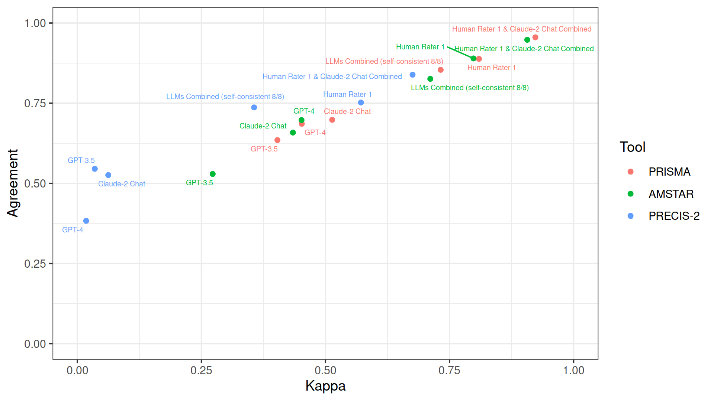

```{r, results='hide'}
suppressPackageStartupMessages(library(ggplot2))
suppressPackageStartupMessages(library(ggrepel))
suppressPackageStartupMessages(library(patchwork))
suppressPackageStartupMessages(library(DT))

REDO_PLOTS = F

# Load all experiments data

folders = c(
  # PRISMA
  prisma_human_rater1="PRISMA-AMSTAR/cullis2017_amstar-prisma_human_rater1", prisma_human_rater2="PRISMA-AMSTAR/cullis2017_amstar-prisma_human_rater2", prisma_llm_self_consistency_5="PRISMA-AMSTAR/cullis2017_amstar-prisma_llm-self-consistency-5", prisma_llm_self_consistency_4="PRISMA-AMSTAR/cullis2017_amstar-prisma_llm-self-consistency-4", prisma_llm_self_consistency_3="PRISMA-AMSTAR/cullis2017_amstar-prisma_llm-self-consistency-3", prisma_exp1_claude="PRISMA-AMSTAR/cullis2017_amstar-prisma_claude2", prisma_exp2_claude="PRISMA-AMSTAR/cullis2017_amstar-prisma_claude2_rep", prisma_exp3_claude_gpt="PRISMA-AMSTAR/cullis2017_prisma_claude2", prisma_exp4_gpt="PRISMA-AMSTAR/cullis2017_prisma_gpt3.5", prisma_exp5_gpt="PRISMA-AMSTAR/cullis2017_prisma_gpt3.5_rep",
  # AMSTAR
  amstar_human_rater1="PRISMA-AMSTAR/cullis2017_amstar-prisma_human_rater1", amstar_human_rater2="PRISMA-AMSTAR/cullis2017_amstar-prisma_human_rater2", amstar_llm_self_consistency_5="PRISMA-AMSTAR/cullis2017_amstar-prisma_llm-self-consistency-5", amstar_llm_self_consistency_4="PRISMA-AMSTAR/cullis2017_amstar-prisma_llm-self-consistency-4", amstar_llm_self_consistency_3="PRISMA-AMSTAR/cullis2017_amstar-prisma_llm-self-consistency-3", amstar_exp1_claude="PRISMA-AMSTAR/cullis2017_amstar-prisma_claude2", amstar_exp2_claude="PRISMA-AMSTAR/cullis2017_amstar-prisma_claude2_rep", amstar_exp3_claude_gpt="PRISMA-AMSTAR/cullis2017_amstar_claude2", amstar_exp4_gpt="PRISMA-AMSTAR/cullis2017_amstar_gpt3.5", amstar_exp5_gpt="PRISMA-AMSTAR/cullis2017_amstar_gpt3.5_rep",
  # PRECIS-2
  precis2_human_rater1="PRECIS-2/pragms-pragqol-56_precis2_human_rater1", precis2_human_rater2="PRECIS-2/pragms-pragqol-56_precis2_human_rater2", precis2_llm_self_consistency_5="PRECIS-2/pragms-pragqol-56_precis2_llm-self-consistency-5", precis2_llm_self_consistency_4="PRECIS-2/pragms-pragqol-56_precis2_llm-self-consistency-4", precis2_llm_self_consistency_3="PRECIS-2/pragms-pragqol-56_precis2_llm-self-consistency-3", precis2_exp1_claude="PRECIS-2/pragms-pragqol-56_loudon2015-toolkit_claude2", precis2_exp2_claude="PRECIS-2/pragms-pragqol-56_loudon2015-toolkit_claude2_rep", precis2_exp3_claude_gpt="PRECIS-2/pragms-pragqol-56_toolkit_claude2", precis2_exp4_gpt="PRECIS-2/pragms-pragqol-56_toolkit_gpt3.5", precis2_exp5_gpt="PRECIS-2/pragms-pragqol-56_toolkit_gpt3.5_rep"
)

get_filename_suffix = Vectorize(function(experiment) {
  if (grepl("prisma", experiment)) {
    domains = 27
    options = 3
  } else if (grepl("amstar", experiment)) {
    domains = 11
    options = 3
  } else if (grepl("precis2", experiment)) {
    domains = 9
    options = 4
  }
  if (grepl("consistency", experiment)) options = options + 1
  paste0(domains, "_domains_", options, "_options")
})

# Experiments vs human consensus

named_i = 1:length(folders)
names(named_i) = names(folders)

consensus_vs = do.call(
  "rbind",
  lapply(named_i, function(i) read.csv(paste0(folders[i], "/results/human_consensus_", get_filename_suffix(names(folders)[i]), ".csv"), row.names = 1)),
)
colnames(consensus_vs) = c("Kappa", "Agreement", "deferring_fraction")

reliability = rbind(
  prisma_human = read.csv("PRISMA-AMSTAR/cullis2017_amstar-prisma_human_rater1/results/reliability_27_domains_3_options.csv", row.names = 1),
  combined = list(NA, NA, NA),
  combined = list(NA, NA, NA),
  combined = list(NA, NA, NA),
  combined = list(NA, NA, NA),
  prisma_claude = read.csv("PRISMA-AMSTAR/cullis2017_amstar-prisma_claude2/results/reliability_27_domains_3_options.csv", row.names = 1),
  combined = list(NA, NA, NA),
  combined = list(NA, NA, NA),
  prisma_gpt = read.csv("PRISMA-AMSTAR/cullis2017_prisma_gpt3.5/results/reliability_27_domains_3_options.csv", row.names = 1),
  combined = list(NA, NA, NA),
  
  amstar_human = read.csv("PRISMA-AMSTAR/cullis2017_amstar-prisma_human_rater1/results/reliability_11_domains_3_options.csv", row.names = 1),
  combined = list(NA, NA, NA),
  combined = list(NA, NA, NA),
  combined = list(NA, NA, NA),
  combined = list(NA, NA, NA),
  amstar_claude = read.csv("PRISMA-AMSTAR/cullis2017_amstar-prisma_claude2/results/reliability_11_domains_3_options.csv", row.names = 1),
  combined = list(NA, NA, NA),
  combined = list(NA, NA, NA),
  amstar_gpt = read.csv("PRISMA-AMSTAR/cullis2017_amstar_gpt3.5/results/reliability_11_domains_3_options.csv", row.names = 1),
  combined = list(NA, NA, NA),

  precis2_human = read.csv("PRECIS-2/pragms-pragqol-56_precis2_human_rater1/results/reliability_9_domains_4_options.csv", row.names = 1),
  combined = list(NA, NA, NA),
  combined = list(NA, NA, NA),
  combined = list(NA, NA, NA),
  combined = list(NA, NA, NA),
  precis2_claude = read.csv("PRECIS-2/pragms-pragqol-56_loudon2015-toolkit_claude2/results/reliability_9_domains_4_options.csv", row.names = 1),
  combined = list(NA, NA, NA),
  combined = list(NA, NA, NA),
  precis2_gpt = read.csv("PRECIS-2/pragms-pragqol-56_toolkit_gpt3.5/results/reliability_9_domains_4_options.csv", row.names = 1),
  combined = list(NA, NA, NA)
)
colnames(reliability) = c("Kappa", "Agreement", "deferring_fraction")

data = data.frame(
  Tool = rep(c("PRISMA", "AMSTAR", "PRECIS-2"), each=10),
  Rater = c("Human Rater", "Human Rater 2", "LLM Self-Consistency 5/5", "LLM Self-Consistency 4/5", "LLM Self-Consistency 3/5", "Claude-2", "Claude-2 repeated", "Claude-2 GPT prompt", "GPT-3.5", "GPT-3.5 repeated"),
  consensus_vs = consensus_vs[grepl("combined", rownames(consensus_vs)), 1:2],
  reliability = reliability[grepl("combined", rownames(reliability)), 1:2],
  main_experiment = c(T, F, T, F, F, T, F, F, T, F),
  path_human_consensus_html = paste0(gsub(".*/", "", folders), "_compare_human_consensus.html"),
  path_reliability_html = paste0(gsub(".*/", "", folders), "_reliability.html"),
  path_human_consensus_png = paste0(folders, "/results/human_consensus_", get_filename_suffix(names(folders)), ".png"),
  path_reliability_png = paste0(folders, "/results/reliability_", get_filename_suffix(names(folders)), ".png"),
  path_human_consensus_item_wise_scatter_png = paste0("plots/human_consensus_", rep(c("prisma_human_rater1", "amstar_human_rater1", "precis2_human_rater1"), each=10), "_", names(folders), ".png"),
  path_reliablility_item_wise_scatter_png = paste0("plots/reliability_", rep(c("prisma_human", "amstar_human", "precis2_human"), each=10), "_", gsub("\\..*", "", rownames(reliability)[grepl("combined", rownames(reliability))]), ".png")
)
data$Tool = factor(data$Tool, c("PRISMA", "AMSTAR", "PRECIS-2"))

# Plots

if (REDO_PLOTS) {
  ## Main experiments overview
  set.seed(1337)
  png = "plots/main-experiments-overview.png"
  png(png, width=1920, height=1080, res=248)
  print(ggplot(data[data$main,], aes(consensus_vs.Kappa, consensus_vs.Agreement, color=Tool)) + 
    geom_point() + xlim(0,1) + ylim(0,1) +
    geom_text_repel(aes(label=Rater), max.overlaps=10) + 
    theme_bw() + xlab("Kappa") + ylab("Agreement"))
  dev.off()
  
  ## Self-consistency overview
  self_consistency = rbind(
    data.frame(
      Tool = "PRISMA",
      `Self-consistency` = rep(c("3/5 consistent", "4/5 consistent", "5/5 consistent"), each=2),
      `Deferring fraction` = rep(c(consensus_vs["prisma_llm_self_consistency_3.combined", "deferring_fraction"], consensus_vs["prisma_llm_self_consistency_4.combined", "deferring_fraction"], consensus_vs["prisma_llm_self_consistency_5.combined", "deferring_fraction"]), each=2),
      Metric = rep(c("Kappa", "Agreement"), 3),
      Value = unlist(c(consensus_vs["prisma_llm_self_consistency_3.combined", c("Kappa", "Agreement")], consensus_vs["prisma_llm_self_consistency_4.combined", c("Kappa", "Agreement")], consensus_vs["prisma_llm_self_consistency_5.combined", c("Kappa", "Agreement")])),
      check.names = F
    ),
    data.frame(
      Tool = "AMSTAR",
      `Self-consistency` = rep(c("3/5 consistent", "4/5 consistent", "5/5 consistent"), each=2),
      `Deferring fraction` = rep(c(consensus_vs["amstar_llm_self_consistency_3.combined", "deferring_fraction"], consensus_vs["amstar_llm_self_consistency_4.combined", "deferring_fraction"], consensus_vs["amstar_llm_self_consistency_5.combined", "deferring_fraction"]), each=2),
      Metric = rep(c("Kappa", "Agreement"), 3),
      Value = unlist(c(consensus_vs["amstar_llm_self_consistency_3.combined", c("Kappa", "Agreement")], consensus_vs["amstar_llm_self_consistency_4.combined", c("Kappa", "Agreement")], consensus_vs["amstar_llm_self_consistency_5.combined", c("Kappa", "Agreement")])),
      check.names = F
    ),
    data.frame(
      Tool = "PRECIS-2",
      `Self-consistency` = rep(c("3/5 consistent", "4/5 consistent", "5/5 consistent"), each=2),
      `Deferring fraction` = rep(c(consensus_vs["precis2_llm_self_consistency_3.combined", "deferring_fraction"], consensus_vs["precis2_llm_self_consistency_4.combined", "deferring_fraction"], consensus_vs["precis2_llm_self_consistency_5.combined", "deferring_fraction"]), each=2),
      Metric = rep(c("Kappa", "Agreement"), 3),
      Value = unlist(c(consensus_vs["precis2_llm_self_consistency_3.combined", c("Kappa", "Agreement")], consensus_vs["precis2_llm_self_consistency_4.combined", c("Kappa", "Agreement")], consensus_vs["precis2_llm_self_consistency_5.combined", c("Kappa", "Agreement")])),
      check.names = F
    )
  )
  self_consistency$Tool = factor(self_consistency$Tool, c("PRISMA", "AMSTAR", "PRECIS-2"))
  
  self_consistency$Self.consistency
  
  png = "plots/self-consistency-overview.png"
  png(png, width=1920, height=1080, res=248)
  print(ggplot(self_consistency, aes(`Deferring fraction`, Value, color=Tool)) + 
    geom_line(aes(linetype=Metric)) + 
    geom_point(aes(shape=`Self-consistency`)) + xlim(0,1) + ylim(0,1) +
    theme_bw() + xlab("Deferring fraction") + ylab("Metric"))
  dev.off()
  
  ## Item-wise scatterplots vs human performance
  
  item_wise_scatter = function(x, y, xlab, ylab, title, data=consensus_vs, filename_prefix="human_consensus") {
    set.seed(1337)
    # Use negative lookahead "(?! )" to preserve "Flex. " in front of "delivery" and "adherence" for PRECIS-2 domains
    plot = function(column) ggplot(data.frame(x=data[grepl(x, rownames(data)), column], y=data[grepl(y, rownames(data)), column], text=gsub(".*\\.(?! )", "", rownames(data)[grepl(x, rownames(data))], perl=T)), aes(x,y)) + 
      geom_point() + 
      geom_text_repel(aes(label=text), max.overlaps=10) + 
      xlim(ifelse(column=="Kappa", -0.25, 0),1) + ylim(ifelse(column=="Kappa", -0.25, 0),1) + 
      geom_abline() + 
      theme_bw() + xlab(xlab) + ylab(ylab) + ggtitle(NULL, subtitle = column)
    
    png = paste0("plots/", filename_prefix, "_", x, "_", y, ".png")
    png(png, width=1920, height=1080, res=248)
    print(plot("Kappa") | (plot("Agreement")+ylab(NULL))) # + plot_annotation(title=title)
    dev.off()
  }
  
  item_wise_scatter(x="prisma_human_rater1", y="prisma_human_rater1", xlab="Human Rater 1 vs Human Consensus", ylab="Human Rater 1 vs Human Consensus", title="PRISMA (Claude-2)")
  item_wise_scatter(x="prisma_human_rater1", y="prisma_human_rater2", xlab="Human Rater 1 vs Human Consensus", ylab="Human Rater 2 vs Human Consensus", title="PRISMA (Claude-2)")
  item_wise_scatter(x="prisma_human_rater1", y="prisma_llm_self_consistency_5", xlab="Human Rater 1 vs Human Consensus", ylab="LMM self-consistency vs Human Consensus", title=paste0("PRISMA (LLM self-consistency 5/5: ", round(consensus_vs["prisma_llm_self_consistency_5.combined", "deferring_fraction"]*100), "% deferred)"))
  item_wise_scatter(x="prisma_human_rater1", y="prisma_llm_self_consistency_4", xlab="Human Rater 1 vs Human Consensus", ylab="LMM self-consistency vs Human Consensus", title=paste0("PRISMA (LLM self-consistency 4/5: ", round(consensus_vs["prisma_llm_self_consistency_4.combined", "deferring_fraction"]*100), "% deferred)"))
  item_wise_scatter(x="prisma_human_rater1", y="prisma_llm_self_consistency_3", xlab="Human Rater 1 vs Human Consensus", ylab="LMM self-consistency vs Human Consensus", title=paste0("PRISMA (LLM self-consistency 3/5: ", round(consensus_vs["prisma_llm_self_consistency_3.combined", "deferring_fraction"]*100), "% deferred)"))
  item_wise_scatter(x="prisma_human_rater1", y="prisma_exp1_claude", xlab="Human Rater 1 vs Human Consensus", ylab="LMM vs Human Consensus", title="PRISMA (Claude-2)")
  item_wise_scatter(x="prisma_human_rater1", y="prisma_exp2_claude", xlab="Human Rater 1 vs Human Consensus", ylab="LMM vs Human Consensus", title="PRISMA (Claude-2 repeated)")
  item_wise_scatter(x="prisma_human_rater1", y="prisma_exp3_claude_gpt", xlab="Human Rater 1 vs Human Consensus", ylab="LMM vs Human Consensus", title="PRISMA (Claude-2 GPT-prompt)")
  item_wise_scatter(x="prisma_human_rater1", y="prisma_exp4_gpt", xlab="Human Rater 1 vs Human Consensus", ylab="LMM vs Human Consensus", title="PRISMA (GPT-3.5)")
  item_wise_scatter(x="prisma_human_rater1", y="prisma_exp5_gpt", xlab="Human Rater 1 vs Human Consensus", ylab="LMM vs Human Consensus", title="PRISMA (GPT-3.5 repeated)")
  
  item_wise_scatter(x="prisma_human", y="prisma_human", xlab="Human Inter-Rater Reliability", ylab="Human Inter-Rater Reliability", title="PRISMA", data=reliability, filename_prefix="reliability")
  item_wise_scatter(x="prisma_human", y="prisma_claude", xlab="Human Inter-Rater Reliability", ylab="Claude-2 Reproducibility", title="PRISMA", data=reliability, filename_prefix="reliability")
  item_wise_scatter(x="prisma_human", y="prisma_gpt", xlab="Human Inter-Rater Reliability", ylab="GPT-3.5 Reproducibility", title="PRISMA", data=reliability, filename_prefix="reliability")
  
  item_wise_scatter(x="amstar_human_rater1", y="amstar_human_rater1", xlab="Human Rater 1 vs Human Consensus", ylab="Human Rater 1 vs Human Consensus", title="AMSTAR (Claude-2)")
  item_wise_scatter(x="amstar_human_rater1", y="amstar_human_rater2", xlab="Human Rater 1 vs Human Consensus", ylab="Human Rater 2 vs Human Consensus", title="AMSTAR (Claude-2)")
  item_wise_scatter(x="amstar_human_rater1", y="amstar_llm_self_consistency_5", xlab="Human Rater 1 vs Human Consensus", ylab="LMM self-consistency vs Human Consensus", title=paste0("AMSTAR (LLM self-consistency 5/5: ", round(consensus_vs["amstar_llm_self_consistency_5.combined", "deferring_fraction"]*100), "% deferred)"))
  item_wise_scatter(x="amstar_human_rater1", y="amstar_llm_self_consistency_4", xlab="Human Rater 1 vs Human Consensus", ylab="LMM self-consistency vs Human Consensus", title=paste0("AMSTAR (LLM self-consistency 4/5: ", round(consensus_vs["amstar_llm_self_consistency_4.combined", "deferring_fraction"]*100), "% deferred)"))
  item_wise_scatter(x="amstar_human_rater1", y="amstar_llm_self_consistency_3", xlab="Human Rater 1 vs Human Consensus", ylab="LMM self-consistency vs Human Consensus", title=paste0("AMSTAR (LLM self-consistency 3/5: ", round(consensus_vs["amstar_llm_self_consistency_3.combined", "deferring_fraction"]*100), "% deferred)"))
  item_wise_scatter(x="amstar_human_rater1", y="amstar_exp1_claude", xlab="Human Rater 1 vs Human Consensus", ylab="LMM vs Human Consensus", title="AMSTAR (Claude-2)")
  item_wise_scatter(x="amstar_human_rater1", y="amstar_exp2_claude", xlab="Human Rater 1 vs Human Consensus", ylab="LMM vs Human Consensus", title="AMSTAR (Claude-2 repeated)")
  item_wise_scatter(x="amstar_human_rater1", y="amstar_exp3_claude_gpt", xlab="Human Rater 1 vs Human Consensus", ylab="LMM vs Human Consensus", title="AMSTAR (Claude-2 GPT-prompt)")
  item_wise_scatter(x="amstar_human_rater1", y="amstar_exp4_gpt", xlab="Human Rater 1 vs Human Consensus", ylab="LMM vs Human Consensus", title="AMSTAR (GPT-3.5)")
  item_wise_scatter(x="amstar_human_rater1", y="amstar_exp5_gpt", xlab="Human Rater 1 vs Human Consensus", ylab="LMM vs Human Consensus", title="AMSTAR (GPT-3.5 repeated)")
  
  item_wise_scatter(x="amstar_human", y="amstar_human", xlab="Human Inter-Rater Reliability", ylab="Human Inter-Rater Reliability", title="AMSTAR", data=reliability, filename_prefix="reliability")
  item_wise_scatter(x="amstar_human", y="amstar_claude", xlab="Human Inter-Rater Reliability", ylab="Claude-2 Reproducibility", title="AMSTAR", data=reliability, filename_prefix="reliability")
  item_wise_scatter(x="amstar_human", y="amstar_gpt", xlab="Human Inter-Rater Reliability", ylab="GPT-3.5 Reproducibility", title="AMSTAR", data=reliability, filename_prefix="reliability")
  
  item_wise_scatter(x="precis2_human_rater1", y="precis2_human_rater1", xlab="Human Rater 1 vs Human Consensus", ylab="Human Rater 1 vs Human Consensus", title="PRECIS-2 (Claude-2)")
  item_wise_scatter(x="precis2_human_rater1", y="precis2_human_rater2", xlab="Human Rater 1 vs Human Consensus", ylab="Human Rater 2 vs Human Consensus", title="PRECIS-2 (Claude-2)")
  item_wise_scatter(x="precis2_human_rater1", y="precis2_llm_self_consistency_5", xlab="Human Rater 1 vs Human Consensus", ylab="LMM self-consistency vs Human Consensus", title=paste0("PRECIS-2 (LLM self-consistency 5/5: ", round(consensus_vs["precis2_llm_self_consistency_5.combined", "deferring_fraction"]*100), "% deferred)"))
  item_wise_scatter(x="precis2_human_rater1", y="precis2_llm_self_consistency_4", xlab="Human Rater 1 vs Human Consensus", ylab="LMM self-consistency vs Human Consensus", title=paste0("PRECIS-2 (LLM self-consistency 4/5: ", round(consensus_vs["precis2_llm_self_consistency_4.combined", "deferring_fraction"]*100), "% deferred)"))
  item_wise_scatter(x="precis2_human_rater1", y="precis2_llm_self_consistency_3", xlab="Human Rater 1 vs Human Consensus", ylab="LMM self-consistency vs Human Consensus", title=paste0("PRECIS-2 (LLM self-consistency 3/5: ", round(consensus_vs["precis2_llm_self_consistency_3.combined", "deferring_fraction"]*100), "% deferred)"))
  item_wise_scatter(x="precis2_human_rater1", y="precis2_exp1_claude", xlab="Human Rater 1 vs Human Consensus", ylab="LMM vs Human Consensus", title="PRECIS-2 (Claude-2)")
  item_wise_scatter(x="precis2_human_rater1", y="precis2_exp2_claude", xlab="Human Rater 1 vs Human Consensus", ylab="LMM vs Human Consensus", title="PRECIS-2 (Claude-2 repeated)")
  item_wise_scatter(x="precis2_human_rater1", y="precis2_exp3_claude_gpt", xlab="Human Rater 1 vs Human Consensus", ylab="LMM vs Human Consensus", title="PRECIS-2 (Claude-2 GPT-prompt)")
  item_wise_scatter(x="precis2_human_rater1", y="precis2_exp4_gpt", xlab="Human Rater 1 vs Human Consensus", ylab="LMM vs Human Consensus", title="PRECIS-2 (GPT-3.5)")
  item_wise_scatter(x="precis2_human_rater1", y="precis2_exp5_gpt", xlab="Human Rater 1 vs Human Consensus", ylab="LMM vs Human Consensus", title="PRECIS-2 (GPT-3.5 repeated)")
  
  item_wise_scatter(x="precis2_human", y="precis2_human", xlab="Human Inter-Rater Reliability", ylab="Human Inter-Rater Reliability", title="PRECIS-2", data=reliability, filename_prefix="reliability")
  item_wise_scatter(x="precis2_human", y="precis2_claude", xlab="Human Inter-Rater Reliability", ylab="Claude-2 Reproducibility", title="PRECIS-2", data=reliability, filename_prefix="reliability")
  item_wise_scatter(x="precis2_human", y="precis2_gpt", xlab="Human Inter-Rater Reliability", ylab="GPT-3.5 Reproducibility", title="PRECIS-2", data=reliability, filename_prefix="reliability")
}
```

Column {data-width=50}
-------------------------------------

### <a onclick="$('#DataTables_Table_0').DataTable().search('TRUE').draw()" style="cursor: pointer">Main Experiments</a> / <a onclick="$('#DataTables_Table_0').DataTable().search('').draw()" style="cursor: pointer">All Experiments</a> (Click links to open experiment details)

```{r}
container = htmltools::withTags(table(
  class = 'display',
  thead(
    tr(
      th(rowspan = 2, 'Tool', width=100),
      th(rowspan = 2, 'Rater', width=120),
      th(colspan = 2, 'Human Consensus'),
      th(colspan = 2, 'Reproducibility'),
      th(rowspan = 2),
      th(rowspan = 2),
      th(rowspan = 2),
      th(rowspan = 2),
      th(rowspan = 2),
      th(rowspan = 2),
      th(rowspan = 2)
    ),
    tr(
      th('Kappa'),
      th('Agreement'),
      th('Kappa'),
      th('Agreement')
    )
  )
))

rater_cell_js = function() paste0("function(data, type, row, meta) { return '<a href=\"html/'+row[7]+'\" target=\"_blank\" title=\"Open experiment details (Rater vs Human Consensus)\">' + data + '</a>' + (row[4] ? ' (<a href=\"html/'+row[8]+'\" target=\"_blank\" title=\"Open experiment details (Rater Reproducibility)\">Reproducibility</a>)' : '') }")

exchange_image = function(i, src) paste0("$(&quot;p.image-container&quot;)[", i, "].style = &quot;background: url(&apos;", src, "&apos;) center center / contain no-repeat;&quot;; $(&quot;p.image-container img&quot;)[", i, "].src = &quot;", src, "&quot;; ")

exchange_title = function(i, innerText) paste0("$(&quot;div.chart-title span&quot;)[", i, "].innerText = &quot;", innerText, "&quot;;")

metrics_cell_js = function(col_id_0, col_id_1, bracket_text) paste0("function(data, type, row, meta) { return '<a href=\"#\" onclick=\"", exchange_image(0, col_id_0), exchange_image(1, col_id_1), exchange_title(0, paste0("' + row[0] + ': ' + row[1] + ': Tool Heatmaps (", bracket_text, ")")), exchange_title(1, paste0("' + row[0] + ': ' + row[1] + ': Item-Wise Performance vs Human Rater 1 (", bracket_text, ")")), "$(&quot;td a&quot;).css(&quot;font-weight&quot;, &quot;normal&quot;); this.style.fontWeight=&quot;bold&quot;; return false;\" title=\"Show experiment plots on the right\">' + (data ? (Math.round(data*100)/100).toFixed(2) : '') + '</a>' }")

datatable(
  data, 
  container=container, 
  rownames = F, 
  options=list(
    bPaginate=F, dom="t",
    columnDefs=list(
      list(targets=1, render=JS(rater_cell_js())), 
      list(targets=2, render=JS(metrics_cell_js("' + row[9] + '", "' + row[11] + '", "Human Consensus"))), # Human Consensus Kappa
      list(targets=3, render=JS(metrics_cell_js("' + row[9] + '", "' + row[11] + '", "Human Consensus"))), # Human Consensus Agreement (same link)
      list(targets=4, render=JS(metrics_cell_js("' + row[10] + '", "' + row[12] + '", "Reproducibility"))), # Reproducibility Kappa
      list(targets=5, render=JS(metrics_cell_js("' + row[10] + '", "' + row[12] + '", "Reproducibility"))), # Reproducibility Agreement (same link)
      list(targets=6:12, visible=F)
    ),
    search=list(search="TRUE")
  )
)# %>% formatRound(4:7, 2)
```

Column {data-width=50}
-------------------------------------

### <span>Main Experiments Overview</span> (<a onclick="$(&quot;td a&quot;).css(&quot;font-weight&quot;, &quot;normal&quot;); `r paste0(exchange_image(0, "plots/main-experiments-overview.png"), exchange_image(1, "plots/self-consistency-overview.png"), exchange_title(0, "Main Experiments Overview"), exchange_title(1, "Self-Consistency Overview"))`" style="cursor: pointer">Show overview</a>)

```{r, results='asis'}
cat(paste0(''))
```

### <span>Self-Consistency Overview</span>

```{r, results='asis'}
cat(paste0(''))
```
