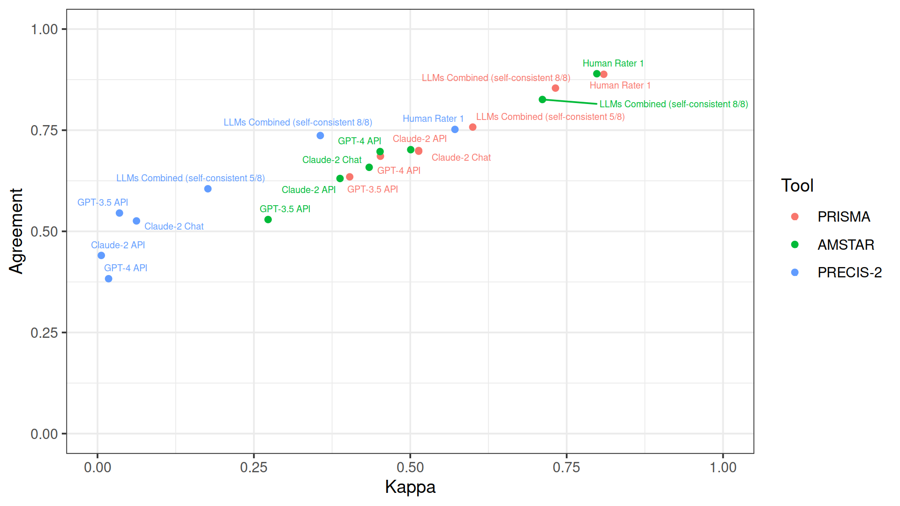

```{r, results='hide'}
suppressPackageStartupMessages(library(ggplot2))
suppressPackageStartupMessages(library(ggrepel))
suppressPackageStartupMessages(library(patchwork))
suppressPackageStartupMessages(library(DT))

REDO_PLOTS = F

# Load all experiments data

folders = c(
  # PRISMA
  #prisma_human_rater1_llm_self_consistency="PRISMA-AMSTAR/human-rater1-llm-self-consistency_prisma-amstar",
  prisma_human_rater1_claude2="PRISMA-AMSTAR/human-rater1-claude2_prisma-amstar",
  prisma_human_rater1="PRISMA-AMSTAR/human-rater1_prisma-amstar", 
  prisma_human_rater2="PRISMA-AMSTAR/human-rater2_prisma-amstar", 
  prisma_llm_self_consistency_5="PRISMA-AMSTAR/llm-self-consistency-5_prisma-amstar", 
  prisma_llm_self_consistency_4="PRISMA-AMSTAR/llm-self-consistency-4_prisma-amstar", 
  prisma_llm_self_consistency_3="PRISMA-AMSTAR/llm-self-consistency-3_prisma-amstar",
  prisma_exp1_claude="PRISMA-AMSTAR/claude2_prisma-amstar", 
  prisma_exp2_claude="PRISMA-AMSTAR/claude2_prisma-amstar_rep", 
  prisma_exp3_claude_gpt="PRISMA-AMSTAR/claude2_prisma-gpt-prompt", 
  prisma_exp4_gpt="PRISMA-AMSTAR/gpt3.5_prisma", 
  prisma_exp5_gpt="PRISMA-AMSTAR/gpt3.5_prisma_rep", 
  # AMSTAR
  #amstar_human_rater1_llm_self_consistency="PRISMA-AMSTAR/human-rater1-llm-self-consistency_prisma-amstar", 
  amstar_human_rater1_claude2="PRISMA-AMSTAR/human-rater1-claude2_prisma-amstar", 
  amstar_human_rater1="PRISMA-AMSTAR/human-rater1_prisma-amstar", 
  amstar_human_rater2="PRISMA-AMSTAR/human-rater2_prisma-amstar", 
  amstar_llm_self_consistency_5="PRISMA-AMSTAR/llm-self-consistency-5_prisma-amstar", 
  amstar_llm_self_consistency_4="PRISMA-AMSTAR/llm-self-consistency-4_prisma-amstar", 
  amstar_llm_self_consistency_3="PRISMA-AMSTAR/llm-self-consistency-3_prisma-amstar",
  amstar_exp1_claude="PRISMA-AMSTAR/claude2_prisma-amstar", 
  amstar_exp2_claude="PRISMA-AMSTAR/claude2_prisma-amstar_rep", 
  amstar_exp3_claude_gpt="PRISMA-AMSTAR/claude2_amstar-gpt-prompt", 
  amstar_exp4_gpt="PRISMA-AMSTAR/gpt3.5_amstar", 
  amstar_exp5_gpt="PRISMA-AMSTAR/gpt3.5_amstar_rep", 
  # PRECIS-2
  #precis2_human_rater1_llm_self_consistency="PRECIS-2/human-rater1-llm-self-consistency_precis2",
  precis2_human_rater1_claude2="PRECIS-2/human-rater1-claude2_precis2", 
  precis2_human_rater1="PRECIS-2/human-rater1_precis2", 
  precis2_human_rater2="PRECIS-2/human-rater2_precis2", 
  precis2_llm_self_consistency_5="PRECIS-2/llm-self-consistency-5_precis2", 
  precis2_llm_self_consistency_4="PRECIS-2/llm-self-consistency-4_precis2", 
  precis2_llm_self_consistency_3="PRECIS-2/llm-self-consistency-3_precis2",
  precis2_exp1_claude="PRECIS-2/claude2_precis2", 
  precis2_exp2_claude="PRECIS-2/claude2_precis2_rep", 
  precis2_exp3_claude_gpt="PRECIS-2/claude2_precis2-gpt-prompt", 
  precis2_exp4_gpt="PRECIS-2/gpt3.5_precis2", 
  precis2_exp5_gpt="PRECIS-2/gpt3.5_precis2_rep"
)

folders_reliability = c(
  # PRISMA
  prisma_human="PRISMA-AMSTAR/human-rater1_prisma-amstar", prisma_claude="PRISMA-AMSTAR/claude2_prisma-amstar",  prisma_gpt="PRISMA-AMSTAR/gpt3.5_prisma",
  # AMSTAR
  amstar_human="PRISMA-AMSTAR/human-rater1_prisma-amstar", amstar_claude="PRISMA-AMSTAR/claude2_prisma-amstar", amstar_gpt="PRISMA-AMSTAR/gpt3.5_amstar",
  # PRECIS-2
  precis2_human="PRECIS-2/human-rater1_precis2", precis2_claude="PRECIS-2/claude2_precis2", precis2_gpt="PRECIS-2/gpt3.5_precis2"
)

get_filename_suffix = Vectorize(function(experiment) {
  if (grepl("prisma", experiment)) {
    items = 27
  } else if (grepl("amstar", experiment)) {
    items = 11
  } else if (grepl("precis2", experiment)) {
    items = 9
  }
  #if (grepl("consistency", experiment)) items = paste("_self_consistency_", items)
  paste0(items, "_items")
})

# Single experiments vs human consensus

named_i = 1:length(folders)
names(named_i) = names(folders)

consensus_vs = do.call(
  "rbind",
  lapply(named_i, function(i) read.csv(paste0(folders[i], "/results/human_consensus_", get_filename_suffix(names(folders)[i]), ".csv"), row.names = 1)),
)
colnames(consensus_vs) = c("Kappa", "Kappa_CI_low", "Kappa_CI_high", "Agreement", "Agreement_CI_low", "Agreement_CI_high", "Deferring Fraction", "Deferring Fraction_CI_low", "Deferring Fraction_CI_high")

data = data.frame(
  Tool = rep(c("PRISMA", "AMSTAR", "PRECIS-2"), each=11),
  Rater = c("Human Rater 1 & Claude-2 Combined", "Human Rater 1", "Human Rater 2", "LLM Combined (self-consistent 5/5)", "LLM Combined (self-consistent 4/5)", "LLM Combined (self-consistent 3/5)", "Claude-2", "Claude-2 repeated", "Claude-2 GPT prompt", "GPT-3.5", "GPT-3.5 repeated"),
  consensus_vs[grepl("combined", rownames(consensus_vs)),],
  main_experiment = c(T, T, F, T, F, F, T, F, F, T, F),
  path_human_consensus_html = paste0(gsub(".*/", "", folders), "_human_consensus.html"),
  path_human_consensus_png = paste0(folders, "/results/human_consensus_", get_filename_suffix(names(folders)), ".png"),
  path_human_consensus_item_wise_scatter_png = paste0("plots/human_consensus_", rep(c("prisma_human_rater1", "amstar_human_rater1", "precis2_human_rater1"), each=11), "_", names(folders), ".png"),
  check.names = F
)
data$Tool = factor(data$Tool, c("PRISMA", "AMSTAR", "PRECIS-2"))

named_i = 1:length(folders_reliability)
names(named_i) = names(folders_reliability)

reliability = do.call(
  "rbind",
  lapply(named_i, function(i) read.csv(paste0(folders_reliability[i], "/results/reliability_", get_filename_suffix(names(folders_reliability)[i]), ".csv"), row.names = 1)),
)
colnames(reliability) = c("Kappa", "Kappa_CI_low", "Kappa_CI_high", "Agreement", "Agreement_CI_low", "Agreement_CI_high", "Deferring Fraction", "Deferring Fraction_CI_low", "Deferring Fraction_CI_high")

data_reliability = data.frame(
  Tool = rep(c("PRISMA", "AMSTAR", "PRECIS-2"), each=3),
  Rater = c("Human Raters 1 & 2", "Claude-2 first & second run", "GPT-3.5 first & second run"),
  reliability[grepl("combined", rownames(reliability)),],
  main_experiment = c(T, T, T),
  path_reliability_html = paste0(gsub(".*/", "", folders_reliability), "_reliability.html"),
  path_reliability_png = paste0(folders_reliability, "/results/reliability_", get_filename_suffix(names(folders_reliability)), ".png"),
  path_reliablility_item_wise_scatter_png = paste0("plots/reliability_", rep(c("prisma_human", "amstar_human", "precis2_human"), each=3), "_", gsub("\\..*", "", rownames(reliability)[grepl("combined", rownames(reliability))]), ".png"),
  check.names = F
)
data_reliability$Tool = factor(data_reliability$Tool, c("PRISMA", "AMSTAR", "PRECIS-2"))

# Plots

if (REDO_PLOTS) {
  ## Main experiments overview
  set.seed(1337)
  png = "plots/main-experiments-overview.png"
  png(png, width=1920, height=1080, res=248)
  print(ggplot(data[data$main,], aes(Kappa, Agreement, color=Tool)) + 
    geom_point() + xlim(0,1) + ylim(0,1) +
    geom_text_repel(aes(label=Rater), max.overlaps=10, size=2) + 
    theme_bw() + xlab("Kappa") + ylab("Agreement"))
  dev.off()
  
  ## Self-consistency overview
  self_consistency = rbind(
    data.frame(
      Tool = "PRISMA",
      `Self-consistency` = rep(c("3/5 consistent", "4/5 consistent", "5/5 consistent"), each=2),
      `Deferring fraction` = rep(c(consensus_vs["prisma_llm_self_consistency_3.combined", "Deferring Fraction"], consensus_vs["prisma_llm_self_consistency_4.combined", "Deferring Fraction"], consensus_vs["prisma_llm_self_consistency_5.combined", "Deferring Fraction"]), each=2),
      Metric = rep(c("Kappa", "Agreement"), 3),
      Value = unlist(c(consensus_vs["prisma_llm_self_consistency_3.combined", c("Kappa", "Agreement")], consensus_vs["prisma_llm_self_consistency_4.combined", c("Kappa", "Agreement")], consensus_vs["prisma_llm_self_consistency_5.combined", c("Kappa", "Agreement")])),
      check.names = F
    ),
    data.frame(
      Tool = "AMSTAR",
      `Self-consistency` = rep(c("3/5 consistent", "4/5 consistent", "5/5 consistent"), each=2),
      `Deferring fraction` = rep(c(consensus_vs["amstar_llm_self_consistency_3.combined", "Deferring Fraction"], consensus_vs["amstar_llm_self_consistency_4.combined", "Deferring Fraction"], consensus_vs["amstar_llm_self_consistency_5.combined", "Deferring Fraction"]), each=2),
      Metric = rep(c("Kappa", "Agreement"), 3),
      Value = unlist(c(consensus_vs["amstar_llm_self_consistency_3.combined", c("Kappa", "Agreement")], consensus_vs["amstar_llm_self_consistency_4.combined", c("Kappa", "Agreement")], consensus_vs["amstar_llm_self_consistency_5.combined", c("Kappa", "Agreement")])),
      check.names = F
    ),
    data.frame(
      Tool = "PRECIS-2",
      `Self-consistency` = rep(c("3/5 consistent", "4/5 consistent", "5/5 consistent"), each=2),
      `Deferring fraction` = rep(c(consensus_vs["precis2_llm_self_consistency_3.combined", "Deferring Fraction"], consensus_vs["precis2_llm_self_consistency_4.combined", "Deferring Fraction"], consensus_vs["precis2_llm_self_consistency_5.combined", "Deferring Fraction"]), each=2),
      Metric = rep(c("Kappa", "Agreement"), 3),
      Value = unlist(c(consensus_vs["precis2_llm_self_consistency_3.combined", c("Kappa", "Agreement")], consensus_vs["precis2_llm_self_consistency_4.combined", c("Kappa", "Agreement")], consensus_vs["precis2_llm_self_consistency_5.combined", c("Kappa", "Agreement")])),
      check.names = F
    )
  )
  self_consistency$Tool = factor(self_consistency$Tool, c("PRISMA", "AMSTAR", "PRECIS-2"))
  
  self_consistency$Self.consistency
  
  png = "plots/self-consistency-overview.png"
  png(png, width=1920, height=1080, res=248)
  print(ggplot(self_consistency, aes(`Deferring fraction`, Value, color=Tool)) + 
    geom_line(aes(linetype=Metric)) + 
    geom_point(aes(shape=`Self-consistency`)) + xlim(0,1) + ylim(0,1) +
    theme_bw() + xlab("Deferring fraction") + ylab("Metric"))
  dev.off()
  
  ## Item-wise scatterplots vs human performance
  
  item_wise_scatter = function(x, y, xlab, ylab, title, data=consensus_vs, filename_prefix="human_consensus") {
    set.seed(1337)
    # Use negative lookahead "(?! )" to preserve "Flex. " in front of "delivery" and "adherence" for PRECIS-2 items
    plot = function(column) ggplot(data.frame(x=data[grepl(paste0(x, "\\."), rownames(data)), column], y=data[grepl(paste0(y, "\\."), rownames(data)), column], text=gsub(".*\\.(?! )", "", rownames(data)[grepl(paste0(x, "\\."), rownames(data))], perl=T)), aes(x,y)) + 
      geom_point() + 
      geom_text_repel(aes(label=text), max.overlaps=10) + 
      xlim(ifelse(column=="Kappa", -0.25, 0),1) + ylim(ifelse(column=="Kappa", -0.25, 0),1) + 
      geom_abline() + 
      theme_bw() + xlab(xlab) + ylab(ylab) + ggtitle(NULL, subtitle = column)
    
    png = paste0("plots/", filename_prefix, "_", x, "_", y, ".png")
    png(png, width=1920, height=1080, res=248)
    print(plot("Kappa") | (plot("Agreement")+ylab(NULL))) # + plot_annotation(title=title)
    dev.off()
  }
  
  item_wise_scatter(x="prisma_human_rater1", y="prisma_human_rater1_claude2", xlab="Human Rater 1 vs Human Consensus", ylab="Human Rater 1 & Claude-2 Combined vs Human Consensus")
  item_wise_scatter(x="prisma_human_rater1", y="prisma_human_rater1", xlab="Human Rater 1 vs Human Consensus", ylab="Human Rater 1 vs Human Consensus")
  item_wise_scatter(x="prisma_human_rater1", y="prisma_human_rater2", xlab="Human Rater 1 vs Human Consensus", ylab="Human Rater 2 vs Human Consensus")
  item_wise_scatter(x="prisma_human_rater1", y="prisma_llm_self_consistency_5", xlab="Human Rater 1 vs Human Consensus", ylab="LLM self-consistency vs Human Consensus")
  item_wise_scatter(x="prisma_human_rater1", y="prisma_llm_self_consistency_4", xlab="Human Rater 1 vs Human Consensus", ylab="LLM self-consistency vs Human Consensus")
  item_wise_scatter(x="prisma_human_rater1", y="prisma_llm_self_consistency_3", xlab="Human Rater 1 vs Human Consensus", ylab="LLM self-consistency vs Human Consensus")
  item_wise_scatter(x="prisma_human_rater1", y="prisma_exp1_claude", xlab="Human Rater 1 vs Human Consensus", ylab="LLM vs Human Consensus")
  item_wise_scatter(x="prisma_human_rater1", y="prisma_exp2_claude", xlab="Human Rater 1 vs Human Consensus", ylab="LLM vs Human Consensus")
  item_wise_scatter(x="prisma_human_rater1", y="prisma_exp3_claude_gpt", xlab="Human Rater 1 vs Human Consensus", ylab="LLM vs Human Consensus")
  item_wise_scatter(x="prisma_human_rater1", y="prisma_exp4_gpt", xlab="Human Rater 1 vs Human Consensus", ylab="LLM vs Human Consensus")
  item_wise_scatter(x="prisma_human_rater1", y="prisma_exp5_gpt", xlab="Human Rater 1 vs Human Consensus", ylab="LLM vs Human Consensus")
  
  item_wise_scatter(x="prisma_human", y="prisma_human", xlab="Human Inter-Rater Reliability", ylab="Human Inter-Rater Reliability", data=reliability, filename_prefix="reliability")
  item_wise_scatter(x="prisma_human", y="prisma_claude", xlab="Human Inter-Rater Reliability", ylab="Claude-2 Intra-Rater Reliability", data=reliability, filename_prefix="reliability")
  item_wise_scatter(x="prisma_human", y="prisma_gpt", xlab="Human Inter-Rater Reliability", ylab="GPT-3.5 Intra-Rater Reliability", data=reliability, filename_prefix="reliability")
  
  item_wise_scatter(x="amstar_human_rater1", y="amstar_human_rater1_claude2", xlab="Human Rater 1 vs Human Consensus", ylab="Human Rater 1 & Claude-2 Combined vs Human Consensus")
  item_wise_scatter(x="amstar_human_rater1", y="amstar_human_rater1", xlab="Human Rater 1 vs Human Consensus", ylab="Human Rater 1 vs Human Consensus")
  item_wise_scatter(x="amstar_human_rater1", y="amstar_human_rater2", xlab="Human Rater 1 vs Human Consensus", ylab="Human Rater 2 vs Human Consensus")
  item_wise_scatter(x="amstar_human_rater1", y="amstar_llm_self_consistency_5", xlab="Human Rater 1 vs Human Consensus", ylab="LLM self-consistency vs Human Consensus")
  item_wise_scatter(x="amstar_human_rater1", y="amstar_llm_self_consistency_4", xlab="Human Rater 1 vs Human Consensus", ylab="LLM self-consistency vs Human Consensus")
  item_wise_scatter(x="amstar_human_rater1", y="amstar_llm_self_consistency_3", xlab="Human Rater 1 vs Human Consensus", ylab="LLM self-consistency vs Human Consensus")
  item_wise_scatter(x="amstar_human_rater1", y="amstar_exp1_claude", xlab="Human Rater 1 vs Human Consensus", ylab="LLM vs Human Consensus")
  item_wise_scatter(x="amstar_human_rater1", y="amstar_exp2_claude", xlab="Human Rater 1 vs Human Consensus", ylab="LLM vs Human Consensus")
  item_wise_scatter(x="amstar_human_rater1", y="amstar_exp3_claude_gpt", xlab="Human Rater 1 vs Human Consensus", ylab="LLM vs Human Consensus")
  item_wise_scatter(x="amstar_human_rater1", y="amstar_exp4_gpt", xlab="Human Rater 1 vs Human Consensus", ylab="LLM vs Human Consensus")
  item_wise_scatter(x="amstar_human_rater1", y="amstar_exp5_gpt", xlab="Human Rater 1 vs Human Consensus", ylab="LLM vs Human Consensus")
  
  item_wise_scatter(x="amstar_human", y="amstar_human", xlab="Human Inter-Rater Reliability", ylab="Human Inter-Rater Reliability", data=reliability, filename_prefix="reliability")
  item_wise_scatter(x="amstar_human", y="amstar_claude", xlab="Human Inter-Rater Reliability", ylab="Claude-2 Intra-Rater Reliability", data=reliability, filename_prefix="reliability")
  item_wise_scatter(x="amstar_human", y="amstar_gpt", xlab="Human Inter-Rater Reliability", ylab="GPT-3.5 Intra-Rater Reliability", data=reliability, filename_prefix="reliability")
  
  item_wise_scatter(x="precis2_human_rater1", y="precis2_human_rater1_claude2", xlab="Human Rater 1 vs Human Consensus", ylab="Human Rater 1 & Claude-2 Combined vs Human Consensus")
  item_wise_scatter(x="precis2_human_rater1", y="precis2_human_rater1", xlab="Human Rater 1 vs Human Consensus", ylab="Human Rater 1 vs Human Consensus")
  item_wise_scatter(x="precis2_human_rater1", y="precis2_human_rater2", xlab="Human Rater 1 vs Human Consensus", ylab="Human Rater 2 vs Human Consensus")
  item_wise_scatter(x="precis2_human_rater1", y="precis2_llm_self_consistency_5", xlab="Human Rater 1 vs Human Consensus", ylab="LLM self-consistency vs Human Consensus")
  item_wise_scatter(x="precis2_human_rater1", y="precis2_llm_self_consistency_4", xlab="Human Rater 1 vs Human Consensus", ylab="LLM self-consistency vs Human Consensus")
  item_wise_scatter(x="precis2_human_rater1", y="precis2_llm_self_consistency_3", xlab="Human Rater 1 vs Human Consensus", ylab="LLM self-consistency vs Human Consensus")
  item_wise_scatter(x="precis2_human_rater1", y="precis2_exp1_claude", xlab="Human Rater 1 vs Human Consensus", ylab="LLM vs Human Consensus")
  item_wise_scatter(x="precis2_human_rater1", y="precis2_exp2_claude", xlab="Human Rater 1 vs Human Consensus", ylab="LLM vs Human Consensus")
  item_wise_scatter(x="precis2_human_rater1", y="precis2_exp3_claude_gpt", xlab="Human Rater 1 vs Human Consensus", ylab="LLM vs Human Consensus")
  item_wise_scatter(x="precis2_human_rater1", y="precis2_exp4_gpt", xlab="Human Rater 1 vs Human Consensus", ylab="LLM vs Human Consensus")
  item_wise_scatter(x="precis2_human_rater1", y="precis2_exp5_gpt", xlab="Human Rater 1 vs Human Consensus", ylab="LLM vs Human Consensus")
  
  item_wise_scatter(x="precis2_human", y="precis2_human", xlab="Human Inter-Rater Reliability", ylab="Human Inter-Rater Reliability", data=reliability, filename_prefix="reliability")
  item_wise_scatter(x="precis2_human", y="precis2_claude", xlab="Human Inter-Rater Reliability", ylab="Claude-2 Intra-Rater Reliability", data=reliability, filename_prefix="reliability")
  item_wise_scatter(x="precis2_human", y="precis2_gpt", xlab="Human Inter-Rater Reliability", ylab="GPT-3.5 Intra-Rater Reliability", data=reliability, filename_prefix="reliability")
}
```

Column {data-width=50 .tabset}
-------------------------------------

### Accuracy: Ratings vs Human Consensus (<a onclick="$('#DataTables_Table_0').DataTable().search('TRUE').draw()" style="cursor: pointer">main</a>/<a onclick="$('#DataTables_Table_0').DataTable().search('').draw()" style="cursor: pointer">all</a>)

```{r}
rater_cell_js = function() paste0("function(data, type, row, meta) { return '<a href=\"html/'+row[12]+'\" target=\"_blank\" title=\"Open experiment details (Rater vs Human Consensus)\">' + data + '</a>' }")

exchange_image = function(i, src) paste0("$(&quot;p.image-container&quot;)[", i, "].style = &quot;background: url(&apos;", src, "&apos;) center center / contain no-repeat;&quot;; $(&quot;p.image-container img&quot;)[", i, "].src = &quot;", src, "&quot;; ")

exchange_title = function(i, innerText) paste0("$(&quot;div.chart-title span&quot;)[", i, "].innerText = &quot;", innerText, "&quot;;")

metrics_cell_js = function(bracket_text="Accuracy: Ratings vs Human Consensus") paste0("function(data, type, row, meta) { return '<a href=\"#\" onclick=\"", exchange_image(0, "' + row[13] + '"), exchange_image(1, "' + row[14] + '"), exchange_title(0, paste0("' + row[0] + ': ' + row[1] + ': Heatmaps (", bracket_text, ")")), exchange_title(1, paste0("' + row[0] + ': ' + row[1] + ': Item-Wise Performance vs Human Rater 1 (", bracket_text, ")")), "$(&quot;td a&quot;).css(&quot;font-weight&quot;, &quot;normal&quot;); this.style.fontWeight=&quot;bold&quot;; return false;\" title=\"Show experiment plots on the right\">' + (data ? ((Math.round(data*100)/100).toFixed(2) + ' (' + (Math.round(row[meta.col+1]*100)/100).toFixed(2) + ' to ' + (Math.round(row[meta.col+2]*100)/100).toFixed(2) + ')') : '') + '</a>' }")

datatable(
  data, 
  rownames = F, 
  extensions="RowGroup",
  options=list(
    rowGroup=list(dataSrc=0),
    bPaginate=F, dom="t",
    columnDefs=list(
      list(targets=1, render=JS(rater_cell_js())), 
      list(targets=2, render=JS(metrics_cell_js())), # Kappa
      list(targets=5, render=JS(metrics_cell_js())), # Agreement (same link)
      list(targets=8, render=JS(metrics_cell_js())), # Deferring Fraction (same link)
      list(targets=c(0,3:4,6:7,9:14), visible=F)
    ),
    search=list(search="TRUE")
  )
)# %>% formatRound(4:7, 2)
```

### Precision: Intra- (LLM) / Inter-Rater-Reliability (Human)

```{r}
rater_cell_js = function() paste0("function(data, type, row, meta) { return '<a href=\"html/'+row[12]+'\" target=\"_blank\" title=\"Open experiment details (Precision: Reliability)\">' + data + '</a>' }")

exchange_image = function(i, src) paste0("$(&quot;p.image-container&quot;)[", i, "].style = &quot;background: url(&apos;", src, "&apos;) center center / contain no-repeat;&quot;; $(&quot;p.image-container img&quot;)[", i, "].src = &quot;", src, "&quot;; ")

exchange_title = function(i, innerText) paste0("$(&quot;div.chart-title span&quot;)[", i, "].innerText = &quot;", innerText, "&quot;;")

metrics_cell_js = function(bracket_text="Precision: Reliability") paste0("function(data, type, row, meta) { return '<a href=\"#\" onclick=\"", exchange_image(0, "' + row[13] + '"), exchange_image(1, "' + row[14] + '"), exchange_title(0, paste0("' + row[0] + ': ' + row[1] + ': Heatmaps (", bracket_text, ")")), exchange_title(1, paste0("' + row[0] + ': ' + row[1] + ': Item-Wise Performance vs Human Rater 1 (", bracket_text, ")")), "$(&quot;td a&quot;).css(&quot;font-weight&quot;, &quot;normal&quot;); this.style.fontWeight=&quot;bold&quot;; return false;\" title=\"Show experiment plots on the right\">' + (data ? ((Math.round(data*100)/100).toFixed(2) + ' (' + (Math.round(row[meta.col+1]*100)/100).toFixed(2) + ' to ' + (Math.round(row[meta.col+2]*100)/100).toFixed(2) + ')') : '') + '</a>' }")

datatable(
  data_reliability, 
  rownames = F, 
  extensions="RowGroup",
  options=list(
    rowGroup=list(dataSrc=0),
    bPaginate=F, dom="t",
    columnDefs=list(
      list(targets=1, render=JS(rater_cell_js())), 
      list(targets=2, render=JS(metrics_cell_js())), # Kappa
      list(targets=5, render=JS(metrics_cell_js())), # Agreement (same link)
      list(targets=c(0,3:4,6:14), visible=F)
    )
  )
)# %>% formatRound(4:7, 2)
```

Column {data-width=50}
-------------------------------------

### <span>Raters vs Human Consensus Overview</span> (<a onclick="$(&quot;td a&quot;).css(&quot;font-weight&quot;, &quot;normal&quot;); `r paste0(exchange_image(0, "plots/main-experiments-overview.png"), exchange_image(1, "plots/self-consistency-overview.png"), exchange_title(0, "Main Experiments Overview"), exchange_title(1, "Self-Consistency Overview"))`" style="cursor: pointer">Show overview</a>)

```{r, results='asis'}
cat(paste0(''))
```

### <span>Raters Combined vs Human Consensus Overview</span>

```{r, results='asis'}
cat(paste0(''))
```
